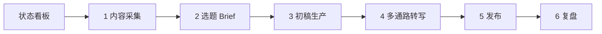
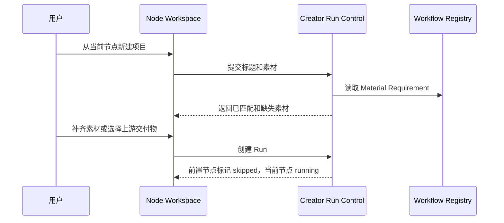

# Newma Creator Studio 前端与控制架构

更新日期：2026-08-14

## 结论

Newma Creator Studio 应采用一套清晰的二维工作流：

- 左侧纵向只表示六个创作阶段。
- 顶部横向只表示当前阶段的子节点。
- 纵向阶段与横向节点确定后，中间只显示一个 Node Workspace。
- 审核、交付物、剪辑、发布全部回到对应节点，不再作为全局业务页面。
- 默认首页是状态看板，显示每个任务真实的动态流程、待审核、交付物和阻塞情况。
- 仓库、Skills、模板和工具统一进入“超市项目”。



核心不是做更多页面，而是做一个深的 `Creator Run Control` Module。前端只学习一套 Run、Stage、Node、Material、Artifact、Gate、Action 和 Event Interface；旧脚本、Manifest、CLI 和外部编辑器的差异由 Adapter 吸收。

## 一、最终信息架构

左侧固定结构：

```text
状态看板
────────
1 内容采集
2 选题 Brief
3 初稿生产
4 多通路转写
5 发布
6 复盘
────────
超市项目
设置
```

进入某个 Workflow Stage 后，顶部显示该阶段的 Workflow Node，并用虚线或箭头连接：

```text
来源配置 ···→ 采集入库 ···→ 清洗归一 ···→ 采集审核
```

横向节点支持五种直接状态：

- 已完成：实线高亮。
- 正在运行：流动虚线和进度。
- 等待用户：黄色审核标记。
- 阻塞或失败：红色断点。
- 下游失效：标记为 `stale`，提醒重新生成。

## 二、六阶段与横向节点

正式定义在 `configs/workflow/newma_creator_studio_registry.json`，前端和后端都从同一注册表读取。

| 纵向阶段 | 横向节点 | 主要交付物 |
|---|---|---|
| 内容采集 | 来源配置 → 采集入库 → 清洗归一 → 采集审核 | 来源配置、采集记录、归一记录、Intake Manifest、Brief Handoff |
| 选题 Brief | 事件归并 → 选题池 → 研究 Brief → 选题审核 | 事件簇、题卡、研究计划、证据缺口、Selected Topics、Draft Handoff |
| 初稿生产 | 证据底稿 → 文章结构 → 长文写作 → 图表与配图 → 初稿审核 | 证据账本、数据表、图片池、Markdown、HTML、Asset Manifest、Transwrite Handoff |
| 多通路转写 | 通路选择 → 剧本重写 → 导演分镜 → 素材生产 → 人工剪辑 → 渲染与 QC → 成片审核 | 视频剧本、分镜、素材清单、时间线、审片、终片、Publish Handoff |
| 发布 | 渠道包装 → 账号路由 → 发布预检 → 执行发布 → 回执验真 | 渠道包、账号路由、发布任务、平台回执、Publish Manifest、Postmortem Handoff |
| 复盘 | 数据回收 → 效果归因 → 知识回写 → 下一轮任务 | 表现数据、复盘报告、DNA 更新、导演规则、下一轮计划 |

六个视频模板不是六套独立前端，而是“多通路转写”中的 Lane：

1. 真人出镜口播。
2. VOX 解释片。
3. 无头口播。
4. AI 数字人。
5. 广告宣传片。
6. 电影短剧，当前仅保留规划能力。

每个 Lane 选择自己的导演、工具和模板，但都经过同一套剧本重写、导演分镜、素材生产、人工剪辑、渲染 QC 和成片审核节点。

## 三、Node Workspace

用户选择一个纵向阶段和一个横向节点后，中间区域固定为 Node Workspace。布局不要随节点完全变化，只替换数据和可执行 Action。

### 顶部摘要

- 节点名称、状态、运行时长和负责人。
- 当前 Run 与项目标题。
- 上游来源和下游目标。
- 当前 Gate、失败原因或下一步建议。

### 主工作区

固定十个标签：

1. 状态。
2. 输入素材。
3. 上游交付物。
4. 当前产物。
5. 参数配置。
6. 修改与反馈。
7. 审核。
8. 人工编辑。
9. 运行日志。
10. 转接下一节点。

节点声明自己真正支持的标签和 Action。例如“导演分镜”显示分镜编辑、花字、人物名和贴纸说明；“人工剪辑”显示时间线、字幕、滤镜、音量和保存后重渲染；“执行发布”显示账号、排期、平台状态和发布结果。

### 底部 Action Bar

只显示注册表允许的操作：

- 运行。
- 重试。
- 保存版本。
- 提交反馈。
- 批准或退回。
- 打开人工编辑器。
- 保存并继续。
- 转接下一节点。

前端不得提交任意终端命令，也不得绕过 Gate 直接改变下游状态。

## 四、默认首页：状态看板

首页先回答“现在需要我做什么”，不堆无关统计。

### 任务动态流程图

每个任务卡显示六阶段总流程，并实时突出当前节点：

```text
DeepSeek 涨价背后的大模型生态

采集 ✓ → Brief ✓ → 初稿 ✓ → 转写 67% → 发布 待审 → 复盘 等待
                              └─ VOX / 素材生产 18/27
                              └─ 无头口播 / 成片审核
```

点击阶段进入该 Stage；点击展开项直接进入具体 Node Workspace。

### 首页信息顺序

1. 等待用户处理的 Gate。
2. 阻塞、失败和 `stale` 节点。
3. 正在运行的任务。
4. 最新交付物。
5. 今日待发布任务。
6. 已完成任务。

### 右上角通知

右上角保留三个计数器：

- 待审核。
- 新交付物。
- 阻塞节点。

点击后打开 Notification Inbox；Node 完成、请求审核、生成新交付物、发布失败和 Handoff 就绪时弹出动态通知。通知只是状态投影，不能成为新的状态源。

## 五、任意节点新建项目

每个 Node Workspace 都有“从这里新建项目”。创建流程必须先校验 Material Requirement：



规则：

- 当前节点的必需素材未满足时不能运行。
- 人工上传和上游 Handoff 都是合法来源，但必须标明来源。
- 从中间节点开始时，前置 Node 标记为 `skipped`，不能伪装成已完成。
- 创建后仍使用完整六阶段 Run，便于继续发布和复盘。

当前控制入口：

```text
python scripts/newma_creator_control.py init-node-project ...
```

## 六、素材与交付物流转

### Material Requirement

每个 Node 声明：

- 素材类型。
- 可接受格式。
- 是否必需。
- 允许人工提供还是只接受上游 Artifact。

### Artifact Handoff

Handoff 不复制文件，只保存版本化引用：

```json
{
  "source_run_id": "run_156",
  "target": {"stage_id": "transwrite", "node_id": "route_select"},
  "materials": [{"type": "transwrite_handoff", "artifact_id": "artifact_021"}],
  "status": "ready"
}
```

流转规则：

- 下游只消费已创建或已批准的 Artifact。
- 人工修改上游后生成新版本，不覆盖旧版本。
- 上游版本变化后，已消费旧版本的下游节点标记为 `stale`。
- “保存草稿”不触发下游；“保存并继续”才创建新 Handoff。
- 所有 Handoff 都可从来源回溯到原始文件和原始 Run。

## 七、Creator Run Control Module

这个 Module 是前后端共同依赖的深 Module，负责把现有零散运行状态统一投影。

### Interface

| Interface | 用途 |
|---|---|
| 读取 Registry | 返回六阶段、节点、Material Requirement、Gate、Action、工具和编辑器声明 |
| 创建 Run | 从第一节点或任意节点创建完整项目运行 |
| 读取 Snapshot | 返回首页、阶段导航、节点状态和通知所需的统一快照 |
| 校验 Material | 返回已匹配素材、缺失素材和可用上游 Artifact |
| 创建 Handoff | 把上游 Artifact 转接为目标节点素材 |
| 执行 Action | 运行、重试、审核、保存版本、继续下游 |
| 检测 Capability | 检测本地 CLI、项目、编辑器和发布连接器 |
| 调用 Capability | 通过 allowlist Adapter 调用，并统一输出结果 |
| 订阅 Event | 通过 SSE 接收状态、进度、日志、交付物和通知增量 |

### 核心对象

| 对象 | 含义 |
|---|---|
| Workflow Definition | 六阶段和全部节点的版本化定义 |
| Workflow Run | 一次完整创作任务 |
| Node Run | 某个节点的一次真实执行 |
| Material Requirement | 节点输入要求 |
| Artifact | 任意版本化交付物 |
| Artifact Handoff | 上下游转接记录 |
| Gate | 人工或策略审核点 |
| Feedback | 用户对节点和产物的修改意见 |
| Action | 注册允许的操作 |
| Event | 状态变化和运行增量 |
| Editor Session | 人工编辑会话和版本回写 |
| Capability Invocation | 一次受控工具或 CLI 调用 |
| Notification | Event 对用户的行动提示 |

### 数据归属

- 原始 Markdown、JSON、HTML、图片、音视频继续保存在项目输出目录。
- SQLite 保存 Run、Node Run、Artifact 索引、Handoff、Gate、Feedback、Event、Editor Session 和 Capability Invocation。
- 前端不直接扫描几十种 Manifest；Adapter 读取旧文件并投影为 Snapshot。
- Event 先持久化，再通过 SSE 推送；断线后按事件序号补拉。

## 八、本地 CLI 与 Agent 调用

参考 HTML Anything 和 HTML Video 的做法，Newma 使用三层结构：

```text
Capability Registry
       ↓
CLI Detection Adapter
       ↓
CLI Invocation Adapter
       ↓
统一 Capability Invocation
```

第一批检测：Codex、Claude Code、Gemini、Cursor Agent、OpenCode、Qwen Code、Qoder、Copilot、Aider、Hermes、FFmpeg。

调用规则：

- 只允许 Registry 中声明为 `output_only` 的 CLI。
- 每个 CLI 有独立 argv Adapter，不允许前端追加任意参数。
- 长提示优先走 stdin，避免命令行转义问题。
- 工作目录必须是明确项目目录，拒绝系统根目录和用户主目录。
- 返回统一的状态、退出码、耗时、标准输出和错误输出。
- 有文件写入或发布副作用的能力使用单独 Action 和确认 Gate，不复用 output-only 调用。

当前控制入口：

```text
python scripts/newma_creator_control.py detect-capabilities
python scripts/newma_creator_control.py invoke-cli ...
```

## 九、超市项目

超市保留三项核心能力：测试、演示、加入预设。

### 分类

1. Repository。
2. Skill。
3. Template。
4. Pipeline。
5. Editor。
6. Publisher。

### 卡片字段

- 当前就绪状态。
- 适用阶段和节点。
- 输入与输出。
- 依赖、许可证、费用和凭据。
- 已安装 Skills。
- 可测试 Demo。

用户选择后先进入方案篮子，经过兼容性检查，再保存为版本化 Pipeline Preset。超市不能直接修改生产 Registry。

Marketplace Compiler 读取：

- `configs/external/reserved_projects.json`
- `configs/workflow/module_registry.json`
- `configs/workflow/stage_reserve_registry.json`
- `configs/video/tool_registry.json`
- `configs/video/director_registry.json`
- `configs/video/upstream_video_skills.json`
- HTML Video、Remotion 和本地视频模板目录

当前控制入口：

```text
python scripts/newma_creator_control.py marketplace
```

## 十、人工编辑器接入

人工编辑不是独立左侧页面，而是 Node Workspace 的“人工编辑”标签。

| 节点 | 首选编辑器 | 回写内容 |
|---|---|---|
| 图表与配图 | HTML Anything、公众号预览 | HTML、图片、图注和版式版本 |
| 导演分镜 | Storyboard Editor、HTML Video Project Studio | Scene Plan、镜头、字幕、花字和说明标签 |
| 人工剪辑 | FableCut、粗剪审核页 | Timeline Exchange、字幕、滤镜、音量和剪辑决策 |
| 渲染与 QC | HTML Video、Remotion、Contact Sheet | 审片、终片、渲染报告和 QC |
| 账号路由 / 执行发布 | 账号与发布控制台 | 账号路由、排期、发布 Job 和回执 |

Editor Session 保存源版本、当前版本和脏状态。用户点击“保存并继续”后：

1. 生成新 Artifact 版本。
2. 旧下游结果标记为 `stale`。
3. 创建新的 Artifact Handoff。
4. 触发目标节点重新运行。

## 十一、前端实现建议

Creator Studio 作为 Newma-Desk 的完整 Mod Suite，前端使用：

- React 19 + TypeScript。
- `@xyflow/react` 展示首页动态流程和复杂 Lane 展开。
- TanStack Query 读取快照、Mutation 和缓存。
- SSE 接收 Event 增量。
- JSON Schema 表单生成参数配置。
- Newma Module SDK 处理主题、Workspace、权限和宿主通知。

视觉方向采用“编辑部控制台”：深色工作台、清晰的阶段色、细虚线流程和高密度但有层次的信息，不使用通用蓝白后台模板。

## 十二、后端代码归属

### 当前媒体仓库

负责真实工作流定义和生产执行：

```text
configs/workflow/newma_creator_studio_registry.json
configs/workflow/newma_namespace_aliases.json
scripts/newma_creator_control.py
scripts/project_run_manifest.py
configs/video/pipelines/*
configs/video/director_registry.json
configs/video/tool_registry.json
```

### Newma-Desk

新增独立 Creator Studio Module，不继续扩展现有 Mod 管理职责：

```text
mod-projects/creator-studio/
  suite.json
  frontend/

services/api/vibe_visualization_api/creator_studio/
  models.py
  repository.py
  projector.py
  events.py
  executor.py
  registry_compiler.py
  capability_adapters.py
  editor_sessions.py
  routes.py
```

现有控制平面只负责 Mod 的安装、权限和会话；Creator Studio Module 负责创作 Run。这两个 Module 共享身份、数据库连接和事件基础设施，但不混合 Interface。

## 十三、命名迁移

对外命名、Registry、Schema、Event、Artifact 和前端标签全部使用 `newma`。

现有旧 Skill 目录和脚本不能一次性物理改名，否则会同时破坏流水线定义、测试、导出包和历史 Manifest。迁移分两步：

1. 当前阶段由 `newma_namespace_aliases.json` 在运行时解析旧 locator，前端永远不展示兼容名称。
2. 后续逐个迁移真实目录和引用；当旧 locator 的调用量归零后删除兼容表。

这样对用户已经完全统一，同时保留当前生产链可运行。

## 十四、当前已落地

- 六阶段、全部横向节点和 Lane 注册表。
- 新旧命名兼容表。
- 从任意节点创建项目。
- 节点素材校验；从任意节点启动时，人工提供的匹配素材会持续保留 Bootstrap 权限。
- 持久化 Creator Execution Job：异步队列、真实取消、重启恢复、后台原子 revision 回写。
- Editor Session Runtime：白名单编辑器启动、保存、关闭和 Artifact 回写。
- 发布执行 Module：发布预检、账号健康、一次性明确确认、真实执行、平台回执和人工验真 Gate。
- Artifact Lineage：版本、内容摘要、父产物、生产 Job、参数摘要和递归 stale 传播。
- 版本化 Artifact Handoff；只传引用，不复制媒体文件，旧 Handoff 失效后不能继续满足素材门禁。
- 状态看板 Snapshot、通知计数、Publish State 和 Lineage 影响范围。
- 本地 CLI 检测与 allowlist 调用。
- Repository、Skill、Template Marketplace 编译。
- Project Run Manifest v2，保留旧 Manifest 读取兼容。
- Newma-Desk Creator Studio Mod 已支持 Agent 与可视化双端共用 Creator Command Interface。
- Video Shotcraft 的注册表、分阶段确认、每镜头产物、QA still 与固定时间线原则已吸收到导演和 Artifact 设计中；具体约束见 `skills/dasheng-vox-skills/references/shotcraft-integration.md`。

下一步重点转向真实项目样本的端到端验收、发布沙盒联调，以及人工编辑器回调协议的标准化。
