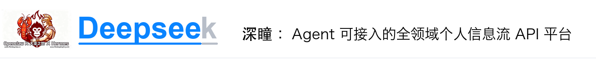

<p align="center">
  
</p>

<p align="center">
  
</p>

<p align="center">
  面向 Agent 接入的个人信息流底座，把微信、邮件、会议、新闻、自媒体、公众号与联系人观点统一沉淀为可查询、可推理、可验证的 API 数据层。
</p>

<p align="center">
  <a href="#核心定位">核心定位</a> ·
  <a href="#功能模块">功能模块</a> ·
  <a href="#agent-api">Agent API</a> ·
  <a href="#安装">安装</a>
</p>

<p align="center">
  
  
  
  
</p>

## 核心定位

Deepsee / 深瞳不是单一消息工具，而是一套面向个人与团队 Agent 的信息流操作系统：

- **统一接入**：汇聚微信、邮件、会议纪要、新闻、自媒体、公众号等高频信息源。
- **结构化沉淀**：将分散内容转为消息、联系人、主题、观点、资产、摘要、评分等可复用数据。
- **Agent 友好**：通过 API 暴露搜索、摘要、评分、趋势、联系人画像与一页通生成能力。
- **推理闭环**：支持 AI 分析、情感洞察、趋势预测、观点验证与联系人价值评分。
- **本地优先**：默认 SQLite 本地存储，适合个人私有部署，也可迁移到云服务器。

## 功能模块

| 模块 | 说明 |
|------|------|
| 数据看板 | 聚合趋势、关键词、热度、情绪、机会/风险信号与运行状态 |
| 微信引擎 | 微信消息接入、清洗去重、黑白名单、摘要与触发规则 |
| 邮件引擎 | 多账户同步、邮件摘要、问答/顶踩与回复链路 |
| 会议引擎 | 会议原文接入、纪要抽取、主题归档与分析注入 |
| 新闻引擎 | 内置新闻采集、热度评分、中文化摘要与趋势排序 |
| 自媒体引擎 | 小红书、抖音、微博、B站等轻量采集与关键词热点搜索 |
| 公众号引擎 | 公众号文章检索、去重、摘要与主题沉淀 |
| 联系人评分 | 基于观点命中、服务价值、风险提示、交流密度的联系人评分卡 |
| 消息群发 | 活动编辑、敬语规则、发送管理与多对象群发 |
| AI 分析 | 多模型路由、一页通、提示词、摘要缓存与增量生成 |

## Agent API

Deepsee 适合作为 Agent 的个人信息流工具层。Agent 可以围绕这些能力构建自动化工作流：

| 能力 | 示例用途 |
|------|----------|
| 消息检索 | 查找某联系人、主题、关键词、时间段内的历史信息 |
| 摘要提炼 | 对微信、邮件、新闻、公众号、会议原文生成要点与一句话评论 |
| 趋势洞察 | 识别高频主题、情绪变化、热点上升、风险信号 |
| 联系人画像 | 读取联系人评分卡、观点历史、命中验证和服务价值 |
| 一页通生成 | 将多模块内容重组为结构化报告或图文材料 |
| 自动触发 | 基于网关规则、黑白名单、时间任务和模型路由执行动作 |

常用接口示例：

| 端点 | 用途 |
|------|------|
| `GET /api/messages` | 消息列表与搜索 |
| `GET /api/messages/mp` | 公众号消息 |
| `GET /api/contact-scoring/contacts` | 联系人评分列表 |
| `GET /api/contact-scoring/contacts/{contact_id}/scorecard` | 联系人评分卡 |
| `GET /api/background/runtime` | 后台任务与模块运行状态 |
| `GET /api/wechat-gateway/config` | 微信网关配置 |
| `POST /api/wechat-gateway/callback` | 微信回调入口 |
| `POST /api/wechat-gateway/trigger-rules` | 触发规则配置 |

## 安装

```bash
git clone https://github.com/leecyno1/Deepsee.git
cd Deepsee
bash scripts/manage.sh install
bash scripts/manage.sh start
```

本地访问：

```bash
uvicorn app.main:app --host 127.0.0.1 --port 8001
```

打开浏览器访问 `http://127.0.0.1:8001/`。

### 内置 Chatlog 依赖

用于本机微信历史补齐的 Chatlog 源码已收录在 `third_party/chatlog/`，无需再从其他
Chatlog 仓库下载。首次使用时在本机编译：

```bash
bash scripts/build_chatlog.sh
```

也可以让本地依赖安装器完成构建：

```bash
python scripts/install_wechat_local_deps.py --tool chatlog_alpha
```

需要 Go 1.24+ 和 CGO 编译环境；生成文件位于 `.local/`，不会提交到 Git。
Chatlog 的 MIT 许可证和免责声明随源码保留在 `third_party/chatlog/`。

## WeChat API 对接

Deepsee 可通过 wechatapi.net 的 iPad 协议接入微信，也可在云服务器侧与 Hermes 等服务组合部署。配置要求：

1. wechatapi token + app_id（从 [wechatapi 控制台](https://wechatapi.net/) 获取）
2. 回调公网 URL（云服务器直接 IP 或域名，无需隧道）
3. AI 模型路由配置（用于自动摘要、分析与回复）
4. Agent 端配置（见下方 wx-auto 配套包）

部署与排障补充：

- 参见 [`docs/wechat-gateway-deployment-notes.md`](docs/wechat-gateway-deployment-notes.md) 获取公网回调绑定、登录状态持久化、WeChatAPI 人脸验证和子 session 行为说明。
- 直连公网 IP 部署时，Deepsee 需要监听 `0.0.0.0`，否则 wechatapi.net 访问公网 callback 可能报 `push msg err`。
- 登录成功后保存 token/app_id/wxid/region_id/device_type 的对应关系，二次登录优先复用 app_id。

触发规则（2026-05 更新）：

- `at_mention_enabled` 默认开启，群聊中被 @ 时自动触发回复。
- 自动回复范围已放宽：除违法内容和系统配置指令外，日常闲聊也可正常互动。
- 黑白名单、前缀匹配、正则匹配、随机触发等规则可通过 `POST /api/wechat-gateway/trigger-rules` 配置。

### Agent 配套包

**https://github.com/leecyno1/wx-auto** 提供 Hermes/Agent 侧的：
- 完整 WeChatAPI 协议文档（7 个模块，100+ 端点）
- 云服务器一键部署脚本
- Hermes Skill 模板
- 新环境安装指引

文档边界：
- 本仓库（Deepsee/0913）内部署/迁移的唯一维护文档：`DEPLOY_FULL.md`
- `wx-auto/DEPLOY.md` 是独立的 Agent 侧 / 跨机部署手册，不替代本仓库内部部署文档

## 开发

```bash
python -m pip install -r requirements-dev.txt
python -m pytest -q
bash scripts/manage.sh dev
```

## 许可证

Apache-2.0 — see `LICENSE`.
