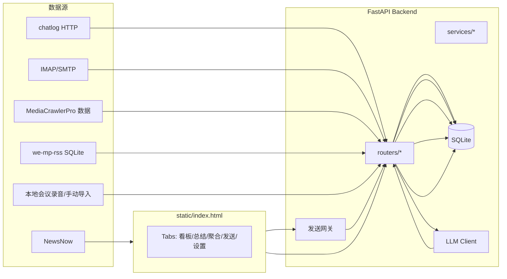

# 架构说明

## 组件

- **FastAPI 后端**：API 聚合、配置管理、SQLite 落库、LLM 调用、发送网关代理
- **SQLite 数据库**：消息/联系人/任务/快照/配置等（默认 `data/app.db`，运行期生成且不入库）
- **单页前端**：`static/index.html`（内联 CSS/JS，快速迭代与可移植部署）

## 数据流（概览）

## 关键设计点

1) **UI 单文件化**
- 便于快速“验收式”迭代，减少前端工程化复杂度

2) **摘要与原文分离**
- 聚合列表与 AI 总结默认更偏向“摘要/关键信息”，减少 token 与噪声

3) **黑白名单前置**
- 在 UI 筛选与后端接口返回层都尽量保证黑名单对象不会进入列表

4) **可扩展的聚合标签**
- “自定义聚合”按适配器拆分，面向未来 LangBot 多平台整合
