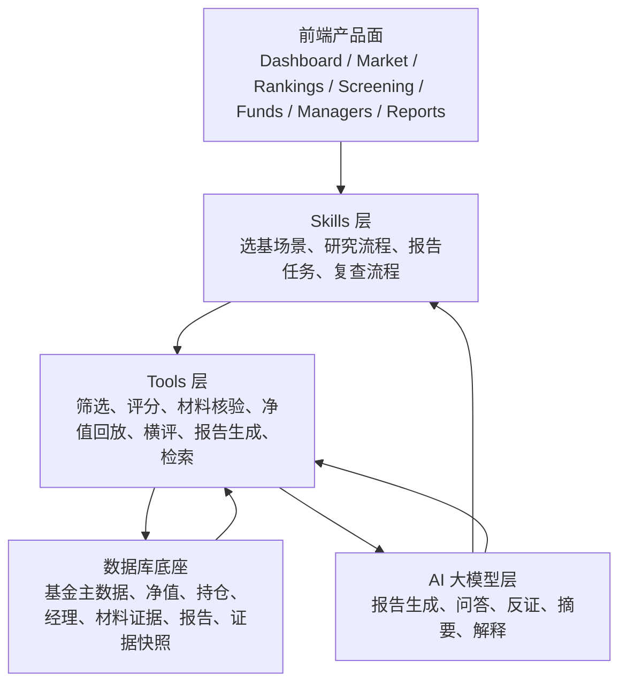
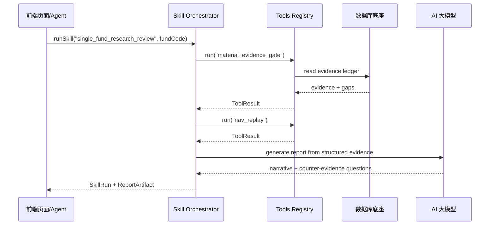

# 基金研究平台分层架构蓝图：Tools、数据库底座、Skills 与 AI 大模型

日期：2026-06-08  
适用范围：基金筛选、基金分析、基金经理评价、材料证据核查、研究清单、报告留痕  
明确排除：投委会、组合构建、交易执行、自动买卖建议

## 1. 目标

当前系统已经具备大量页面和能力，但下一阶段的重点不是继续加页面，而是把基金研究系统整理成一个“能整能零”的能力平台：

- **能整**：作为一个完整基金研究工具，从全市场浏览、筛选、排行榜、基金详情、横向比较、研究清单、报告库到材料证据核查形成闭环。
- **能零**：任一能力都能单独作为工具调用，例如“查某基金材料缺口”“生成某基金研究复核报告”“对比两只基金”“评估基金经理名下产品证据”。
- **可插拔**：数据源、计算工具、AI 模型、报告模板、前端入口可以替换或独立部署。
- **证据优先**：所有输出必须能说明数据来源、更新时间、缺口、硬门禁和下一步动作；缺证不得默认为正向。

## 2. 四层目标架构



### 2.1 数据库底座层

数据库底座只回答一个问题：**当前有哪些可追溯的基金研究事实？**

现有对应模块：

- `prisma/schema.prisma`
  - `Fund`, `Manager`, `ResearchReport`, `ResearchReportChunk`, `Score`, `ScreeningCriteria`
  - `DataSourceSnapshot`, `MetricSnapshot`, `FundPool`, `PoolMember`, `AlertRule`, `AlertEvent`
  - `Holding`, `HoldingFactor`, `FactorExposure`, `PerformanceAttribution`, `ManagerProfile`
- `backend/repositories/*`
  - `fund_repo.py`, `nav_repo.py`, `holding_repo.py`, `manager_repo.py`, `metric_snapshot_repo.py`, `fund_pool_repo.py`, `alert_repo.py`
- `lib/db.ts`, `lib/prisma.ts`

目标责任：

1. 保存事实，不保存交易判断。
2. 每个关键字段保留来源、更新时间、覆盖区间和缺口状态。
3. R1-R5、申赎、费率、起购/定投、限购、赎回规则等材料核验字段必须有 30 天内来源背书。
4. AI 输出必须落回报告、切片、证据引用或审计字段，不直接覆盖事实。

建议新增或收敛的接口：

- `EvidenceLedger`：统一表达字段级证据、来源、时效、缺口、硬门禁。
- `ResearchSnapshot`：统一表达一次研究任务使用的数据版本。
- `ReportArtifact`：统一表达报告正文、结构化结论、证据引用、复用状态。

### 2.2 Tools 层

Tools 层只回答一个问题：**我可以对基金研究事实做哪些确定性操作？**

它应该是 AI、前端、脚本、批处理都能调用的工具集合。工具不应依赖某个页面，也不应输出交易建议。

现有对应模块：

- 数据同步工具
  - `backend/services/tushare_service.py`
  - `backend/services/wind_service.py`
  - `app/api/sync/wind/route.ts`
  - `scripts/fund_research_real_data_report.mjs`
- 评分与筛选工具
  - `backend/services/scoring_engine.py`
  - `backend/services/professional_scoring_service.py`
  - `lib/scoring.ts`
  - `app/api/market/research-candidates/route.ts`
  - `app/api/screening/route.ts`
- 证据与规则工具
  - `lib/buy-evidence.ts`
  - `lib/sales-rule-validation.ts`
  - `lib/sales-rule-gaps.ts`
  - `lib/evidence-coverage.ts`
  - `app/api/sales-rules/*`
- 横评与回放工具
  - `lib/research-platform/tools/peer-group-benchmark.ts`
  - `lib/research-platform/tools/comparison-research-score.ts`
  - `lib/research-platform/tools/comparison-research-summary.ts`
  - `lib/research-platform/tools/comparison-win-loss-audit.ts`
  - `lib/research-platform/tools/market-compare-basket-evidence.ts`
  - `lib/research-platform/tools/market-compare-basket-win-loss.ts`
  - `lib/research-platform/tools/market-current-page-shortlist.ts`
  - `lib/research-platform/tools/market-decision-explainer.ts`
  - `lib/research-platform/tools/market-promotion-queue.ts`
  - `lib/fund-comparison-report-markdown.ts`
  - `app/api/funds/compare-matrix/route.ts`
  - `lib/fund-comparison-report.ts`
  - `lib/comparison-decisive-audit.ts`
  - `app/api/funds/[id]/purchase-simulation/route.ts`
- 报告与检索工具
  - `lib/pre-purchase-report.ts`
  - `lib/report-buy-before-decision.ts`
  - `lib/report-buy-before-evidence-queue.ts`
  - `backend/services/search_service.py`
  - `backend/services/vector_db_service.py`

目标工具接口形态：

```ts
type ToolResult<T> = {
  ok: boolean
  data?: T
  evidence: EvidenceRef[]
  gaps: EvidenceGap[]
  hardBlocks: string[]
  nextActions: ResearchAction[]
  audit: {
    tool: string
    version: string
    inputHash: string
    generatedAt: string
  }
}
```

每个工具必须满足：

- 输入可序列化，输出可审计。
- 同样输入应尽量可复现。
- 出错时显式失败，不回退到 mock 证据。
- 缺失字段必须进入 `gaps` 或 `hardBlocks`，不能隐式给中性分。
- 可被页面调用，也可被 AI agent 调用。

### 2.3 Skills 层

Skills 层只回答一个问题：**在某个基金研究场景下，应该怎样组合工具形成流程？**

Skills 不是页面组件，也不是大模型 prompt。它是“领域流程配方”：定义步骤、门禁、输入输出、失败处理和可复用动作。

建议沉淀的核心 Skills：

1. **全市场初筛 Skill**
   - 工具组合：基金库查询 → 证据覆盖 → 画像适配 → 销售规则初扫 → 晋级队列。
   - 现有页面：`/market`, `/screening`, `/rankings`。

2. **单基金研究复核 Skill**
   - 工具组合：基础信息 → 净值回放 → 费用/申赎/R1-R5 → 持仓暴露 → 同类替代 → 报告门禁。
   - 现有页面：`/funds/[id]`, `/api/funds/[id]/pre-purchase-report`。

3. **横向比较 Skill**
   - 工具组合：候选样本校验 → 同类分位 → 费后回放 → 胜负线/淘汰线 → 保存横评报告。
   - 现有页面：`/analysis/comparison`, `/api/funds/compare-matrix`。

4. **基金经理评价 Skill**
   - 工具组合：经理履历 → 任期切片 → 名下基金证据门禁 → 反证核查 → 经理报告。
   - 现有页面：`/managers`, `/managers/[id]`, `/analysis/manager`。

5. **报告复用 Skill**
   - 工具组合：报告搜索/列表 → 今日沿用判断 → R1-R5/销售规则/回放时效检查 → 重跑或降级。
   - 现有页面：`/reports`, `/reports/search`, `/reports/[id]`。

6. **证据修复 Skill**
   - 工具组合：缺口聚类 → TSV 工作单 → Tushare 基础状态补齐 → 人工销售平台字段补录 → 复查队列关闭。
   - 现有页面：`/sales-rules`, `/evidence-coverage`, `/alerts`。

Skill 的标准输出建议统一为：

```ts
type SkillRun = {
  skillName: string
  subject: Fund | Fund[] | Manager | Report
  decision: 'research_ready' | 'verify_first' | 'blocked' | 'historical_trace'
  evidence: EvidenceRef[]
  gaps: EvidenceGap[]
  actions: ResearchAction[]
  reports?: ReportArtifact[]
  guardrails: string[]
}
```

### 2.4 AI 大模型层

AI 大模型层只回答一个问题：**如何把结构化证据变成可读、可追问、可复核的研究表达？**

AI 不应该直接查数据库、直接改事实、直接给交易建议。AI 应通过 Tools 和 Skills 工作：

- 读取工具返回的结构化证据。
- 生成研究解释、报告、反证清单、复查问题。
- 标注哪些是事实、哪些是推理、哪些是缺口。
- 不覆盖硬门禁，不把缺证解释成可行。

现有对应模块：

- `backend/services/ai_report.py`
- `backend/services/research_memo_service.py`
- `backend/routes/ai_reports.py`
- `backend/routes/research_memos.py`
- `app/api/analysis/generate/route.ts`
- `app/api/reports/real-data/route.ts`

目标调用链：



AI 层必须有三条红线：

1. 不直接生成“买入/卖出/交易建议”。
2. 不把 Tushare `fund_basic` 当作 R1-R5 或交易费率来源。
3. 不在证据缺失时生成正向结论。

## 3. 当前系统的主要架构摩擦

### 3.1 页面里沉淀了太多流程逻辑

大量页面曾经沉淀过买前门禁、TSV、复查、横评、报告复用逻辑；其中排行榜、基金池、销售规则工作台和复查队列页面已经合并为 redirect-only 入口，后续只保留 canonical 研究页面，例如：

- `app/(dashboard)/market/MarketBrowserClient.tsx`
- `app/(dashboard)/screening/page.tsx`
- `app/(dashboard)/reports/page.tsx`
- `app/(dashboard)/reports/search/page.tsx`

问题不是功能不够，而是这些能力还没有抽象成 Skills 和 Tools，因此难以独立调用、复用、测试和组合。

### 3.2 Next.js API 与 FastAPI 职责混合

当前有两类后端：

- `app/api/*`：大量 BFF + 业务判断 + 证据门禁。
- `backend/routes/*` + `backend/services/*`：Python 计算、数据同步、报告、评分、归因。

建议目标：

- Next.js API 逐步收敛为 **BFF Adapter**：负责页面参数、鉴权、聚合、前端友好响应。
- Python/FastAPI 或共享 lib 收敛为 **Research Tool Runtime**：负责可复用工具计算。
- 所有关键证据门禁必须有可测试的工具接口，而不是只存在页面逻辑中。

### 3.3 AI 调用缺少统一 Tool Registry

当前 AI 报告生成散落在后端服务和 Next API 中。下一步应增加一层 `Tool Registry` / `Skill Registry`，让 AI 只能通过声明式工具能力拿数据。

建议目录：

```text
lib/research-tools/
  registry.ts
  types.ts
  material-evidence-gate.ts
  research-evidence.ts
  comparison.ts
  report-reuse.ts
  evidence-coverage.ts

lib/research-skills/
  registry.ts
  types.ts
  full-market-screening.ts
  single-fund-research-review.ts
  fund-comparison.ts
  manager-evaluation.ts
  report-reuse.ts
  evidence-repair.ts
```

Python 侧可对应：

```text
backend/tools/
  registry.py
  contracts.py
  nav_replay.py
  peer_percentile.py
  factor_lens.py
  report_generation.py

backend/skills/
  contracts.py
  single_fund_research_review.py
  manager_evaluation.py
  fund_comparison.py
```

## 4. 推荐的“能整能零”接口

### 4.1 Tool Manifest

每个工具用 Manifest 暴露能力，而不是让调用方理解内部实现。

```ts
type ResearchToolManifest = {
  name: string
  domain: 'fund' | 'manager' | 'report' | 'pool' | 'evidence'
  inputSchema: unknown
  outputSchema: unknown
  evidencePolicy: 'strict_30d' | 'snapshot' | 'derived_metric' | 'narrative'
  canRunBatch: boolean
  sideEffects: 'none' | 'read_db' | 'write_report' | 'write_pool' | 'write_evidence'
  guardrails: string[]
}
```

例子：

- `sales_rule_gate.check`
- `buy_evidence.evaluate`
- `nav_replay.simulate`
- `fund_compare.matrix`
- `report.reuse_assess`
- `evidence_coverage.audit`
- `manager.tenure_slice`

### 4.2 Skill Manifest

Skill 是工具编排：

```ts
type ResearchSkillManifest = {
  name: string
  purpose: string
  stages: Array<{
    key: string
    tool: string
    required: boolean
    failureMode: 'block' | 'downgrade' | 'observe_only'
  }>
  outputDecision: Array<'research_ready' | 'verify_first' | 'blocked' | 'historical_trace'>
  allowedSurfaces: Array<'page' | 'api' | 'agent' | 'batch'>
  guardrails: string[]
}
```

例子：`single_fund_pre_purchase`：

1. `fund_profile.read`
2. `sales_rule_gate.check`，失败则 `blocked`
3. `nav_replay.simulate`，失败则 `verify_first`
4. `holding_exposure.audit`，失败则 `verify_first`
5. `peer_percentile.compare`，样本不足则 `verify_first`
6. `report.generate_pre_purchase`，只在门禁允许时写报告

### 4.3 AI Agent 只调用 Skill，不绕过 Tool

AI 入口建议统一为：

```ts
type AiResearchRequest = {
  task: 'explain' | 'generate_report' | 'counter_evidence' | 'next_actions'
  skillRunId?: string
  skillName: string
  subjectIds: string[]
  userContext: {
    riskProfile: string
    horizon: string
    purchasePlan: string
    plannedAmount: number
  }
}
```

AI 输出必须引用 `SkillRun` 的证据，不允许直接编造。

## 5. 分层后的产品形态

### 5.1 完整使用形态

用户从 `/overview` 或 `/market` 开始：

1. 全市场浏览：调用 `full_market_screening` Skill。
2. 排行榜：调用 `ranking_explain` 与 `leader_four_questions` Skill。
3. 筛选页：调用 `screening_condition_health` Skill。
4. 横向比较：调用 `fund_comparison` Skill。
5. 单基金详情：调用 `single_fund_pre_purchase` Skill。
6. 候选池：调用 `candidate_pool_review` Skill。
7. 报告库：调用 `report_reuse` Skill。
8. AI 报告：读取 SkillRun，生成解释和反证。

### 5.2 零散调用形态

外部系统或 agent 也可以只调用某一段：

- “给我 519674.OF 的销售规则缺口” → `sales_rule_gate.check`
- “这 3 只基金能否横评” → `fund_compare.preflight`
- “这份报告今天还能不能用” → `report.reuse_assess`
- “某基金经理名下产品是否证据完整” → `manager.product_gate_audit`
- “把当前缺口导出工作单” → `evidence_repair.work_order`

## 6. 推荐目录演进

第一阶段不大重构，只新增薄抽象，把现有逻辑逐步迁移进去：

```text
lib/research-platform/
  contracts/
    evidence.ts
    tool-result.ts
    skill-run.ts
    guardrails.ts
  tools/
    material-evidence-gate.ts
    research-evidence.ts
    report-reuse.ts
    screening-health.ts
    ranking-leader-questions.ts
    peer-group-benchmark.ts
    comparison-research-score.ts
    comparison-research-summary.ts
    comparison-win-loss-audit.ts
    market-compare-basket-evidence.ts
    market-compare-basket-win-loss.ts
    market-current-page-shortlist.ts
    market-decision-explainer.ts
    market-promotion-queue.ts
  skills/
    full-market-screening.ts
    single-fund-research-review.ts
    comparison.ts
    manager-evaluation.ts
    report-reuse.ts
  adapters/
    next-api.ts
    backend-api.ts
    ai-model.ts
```

迁移顺序：

1. 先抽 `contracts`，不改变页面行为。
2. 再抽纯计算型 tools，例如 `report-reuse`, `screening-health`, `ranking-leader-questions`, `peer-group-benchmark`, `comparison-research-score`, `comparison-research-summary`, `comparison-win-loss-audit`, `market-compare-basket-evidence`, `market-compare-basket-win-loss`, `market-current-page-shortlist`, `market-decision-explainer`, `market-promotion-queue`。
3. 再抽带数据读取的 tools，例如 `material-evidence-gate`, `evidence-coverage`；旧 `sales-rule-gate` 只保留兼容语义，不再作为新增能力入口。
4. 最后抽 skills，把页面变成 SkillRun 的渲染器。

## 7. 推荐演进路线

### Phase A：定义接口，不重构业务

- 新增 `lib/research-platform/contracts/*`。
- 给现有页面新增 adapter，把当前内部对象映射为 `ToolResult` / `SkillRun`。
- 目标：现有测试全过，页面无行为变化。

### Phase B：抽出确定性 Tools

优先抽页面内重复且可纯函数化的能力：

- 报告今日沿用判断。
- 榜首研究复核四问。
- 筛选条件健康诊断。
- 同类组、宽口径资产桶和基准映射。
- 横评研究评分、权重、缺口封顶和理由解释。
- 横评研究摘要、判断依据和排序原因。
- 横评胜负线、置信审计和反转条件。
- 横评报告 Markdown 渲染。
- 全市场对比篮证据工作单、下一步动作和 TSV。
- 全市场对比篮胜负线、研究分层和 TSV。
- 当前页研究短名单评分、分层、主动作和 TSV。
- 当前页决策质量解释、排序说明、金额门禁和复查队列主动作。
- 全市场晋级分流、任务队列、门禁审计和 TSV。
- 研究清单短名单决策。

这些 Tools 不需要先动数据库，风险最低。

### Phase C：统一 Evidence Ledger

- 把销售规则、R1-R5、费用、申赎、限购、净值回放、持仓证据统一成字段级证据账本。
- 所有页面和 AI 报告都读取同一种缺口对象。
- 目标：缺证、过期、来源不合格在全系统口径一致。

### Phase D：建立 Skill Registry

- 每个 Skill 声明 stages、工具依赖、失败降级、输出决策。
- 页面只负责展示 SkillRun。
- Agent/AI 调用 Skill，而不是直接读页面 API。

### Phase E：AI 模型编排层

- 接入 SiliconFlow/DeepSeek 或其他模型时，只作为 `AiModelAdapter`。
- Prompt 输入必须来自 SkillRun 和 EvidenceLedger。
- 模型失败时不冒充结论，降级为本地证据报告。

## 8. 模块边界硬规则

1. **数据库底座不输出建议**：只存事实、证据、快照、报告和缺口。
2. **Tools 不关心页面**：工具输入输出可被 API、AI、批处理、页面复用。
3. **Skills 不写死模型**：Skill 编排工具，AI 只是其中一个可选 adapter。
4. **AI 不绕过门禁**：AI 不能跳过销售规则/R1-R5/费用/横评/报告门禁。
5. **页面不承载核心规则**：页面只展示 SkillRun 和 ToolResult，不再成为唯一规则载体。
6. **输出不使用交易指令**：只能输出研究清单、补证观察、正式研究复核、历史回看等研究语义。
7. **旧入口必须正位**：页面和工具不得直接扩散 `/investor-selection`、`/pools`、`/rankings` 语义；需要兼容时必须经过 `canonicalResearchHref` 映射到全市场研究库、研究清单或同类横评。

## 9. 第一批建议落地任务

1. 新增 `lib/research-platform/contracts`，定义 `EvidenceRef`, `EvidenceGap`, `ToolResult`, `SkillRun`, `ResearchAction`。
2. 抽出 `screening-condition-health` tool，对应当前筛选页健康诊断。
3. 抽出 `ranking-leader-questions` tool，对应排行榜榜首研究复核四问。
4. 抽出 `report-reuse-assessment` tool，对应报告列表和报告搜索今日沿用判断。
5. 抽出 `peer-group-benchmark` tool，对应同类组、基准映射和样本充分性判断。
6. 抽出 `comparison-research-score` tool，对应横评研究评分、权重和证据缺口封顶。
7. 抽出 `comparison-research-summary` tool，对应横评研究摘要和排序原因。
8. 抽出 `comparison-win-loss-audit` tool，对应横评胜负线、置信审计和反转条件。
9. 抽出 `fund-comparison-report-markdown` renderer，对应横评报告 Markdown 正文。
10. 抽出 `market-compare-basket-evidence` tool，对应全市场对比篮证据工作单、下一步动作和 TSV。
11. 抽出 `market-compare-basket-win-loss` tool，对应全市场对比篮胜负线、研究分层和 TSV。
12. 抽出 `market-current-page-shortlist` tool，对应当前页研究短名单评分、分层、主动作和 TSV。
13. 抽出 `market-decision-explainer` tool，对应当前页决策质量解释、主动作、排序说明、金额门禁和复查队列优先级。
14. 抽出 `market-promotion-queue` tool，对应全市场晋级分流、任务队列、门禁审计和 TSV。
15. 抽出 `canonicalResearchHref` route seam，对应旧入口正位、首页冗余链接清理和兼容跳转收敛。
16. 新增 `tools registry smoke`，验证每个工具有 manifest、guardrails 和无交易文案。
17. 新增 `skills registry smoke`，验证核心 Skills 不引用投委会、组合构建、交易执行。
18. 逐步把页面内同名逻辑替换为 tool 调用。

## 10. 建议的成功标准

当系统达到以下状态，才算真正具备“能整能零”的架构：

- 任一页面的核心判断都能在 Tools 层独立运行。
- 任一完整研究流程都能以 SkillRun 形式保存和复现。
- AI 报告只消费 ToolResult / SkillRun / EvidenceLedger。
- 数据库能回答每个结论用到了哪些来源、是否过期、缺口在哪里。
- 前端、API、批处理、AI agent 对同一基金得到同一套硬门禁结论。
- 删除某个页面不会删除核心研究能力，只会删除一个展示入口。
