[对应IMA知识库](https://ima.qq.com/wiki/?shareId=8b0da768c77bc863f1cad8eb9482e37a6eeb26ad7171523b687d48c1a67c8e2c)：股票量化因子 AI 决策引擎，2200 + 维专业因子池，AI 深度解析多维数据，精准挖掘高确定性个股，赋能专业投资高效稳健决策。 https://ima.qq.com/wiki/?shareId=8b0da768c77bc863f1cad8eb9482e37a6eeb26ad7171523b687d48c1a67c8e2c 。

**InStock Analysis · Newma-Desk 附属模组**

本分支把 InStock 上游仍有研究价值的能力整理为 11 个 Newma-Desk 原生工作台：市场概览、大盘云图、A/H 股候选、选股中心、CZSC 结构、行业/ETF 轮动、产业链研究、股票研究档案、策略验证、事件与资金、研究组合。Newma-Desk 负责模组发现、进程生命周期、数据路由、权限、Action Gateway、Agent 与页面容器；本项目不再作为独立 Web 产品或独立部署单元发布。

项目保留上游分析实现供兼容与演进，但模组运行时默认不连接 MySQL、不启动交易服务、不执行原项目定时抓取任务，行情统一通过 Newma-Desk Data Service Interface 获取。

## InStock 分析工作台

项目不复刻上游旧站点。市场、指标、K 线形态、经典策略和选股能力都通过 Desk 原生页面重新组织；生产数据只从 Newma-Desk Data Service Interface 进入，项目内负责确定性计算、解释、Snapshot 和可视化。旧接口仅作维护诊断兼容；不要求改造 Desk，也不维护另一套数据、Agent 或模型系统。

CZSC 当前固定使用最新稳定版 `0.10.12`。官方 `1.0.0rc8` 已迁移 Rust/PyO3 并删除旧信号命名空间；本项目已为七组官方规则建立 Rust registry Adapter，但不会自动把预发布版用于生产。核心结构兼容探针、双 Adapter 与正式升级门槛见 `docs/upstream-compatibility.md`。

```bash
python3.12 -m venv .venv
.venv/bin/python -m pip install \
  -r requirements-attached.txt \
  -c requirements-attached.constraints.txt

# 仅初始化附属运行时依赖；不单独启动项目服务
```

`requirements-attached.txt` 是 Desk 托管运行时的顶层安装合同，不包含 MySQL、自动交易、上游抓取器或旧 Bokeh 页面依赖；`requirements-attached.constraints.txt` 是 Python 3.12 的跨平台认证约束快照，用于固定 CZSC 完整传递依赖闭包。CZSC 官方包自身声明了 PyArrow、Polars、SciPy、Plotly、Streamlit 等完整依赖；本项目遵守该包合同，不使用 `--no-deps` 做不可验证的裁剪。升级顶层依赖时使用约束文件首部的 `uv pip compile` 命令重算快照，并重新运行在线发布门禁。`requirements.txt` 仅保留给需要运行上游完整诊断功能的维护者。

```bash
# 从 Newma-Desk 根目录统一启动；Desk 自动发现工作区并托管 9988 运行时
cd /path/to/newma-desk
npm run dev:stack
npm run dev:status -- --strict
```

Desk 的 `instock` Runtime Adapter 会注入 `INSTOCK_SKIP_DB=1`、统一数据接口、精确嵌入 Origin 与本地监听地址，并直接启动 `.venv/bin/python instock/web/web_service.py`。`9988` 是附属运行时端口，不是面向用户独立发布的产品入口；生产环境通过 `NEWMA_DESK_INSTOCK_WORKSPACE` 与 `NEWMA_DESK_INSTOCK_WEB_URL` 由 Desk Runtime Descriptor 解析。

模组运行时页面（通常由 Desk iframe 打开）：

- 市场概览：`http://127.0.0.1:9988/mods/market-workbench`
- 大盘云图：`http://127.0.0.1:9988/mods/market-map`
- 选股中心：`http://127.0.0.1:9988/mods/technical-signals`
- CZSC：`http://127.0.0.1:9988/mods/czsc`
- A 股候选：`http://127.0.0.1:9988/mods/stock-candidates`
- 股票研究档案：`http://127.0.0.1:9988/mods/stock-research`
- 策略验证：`http://127.0.0.1:9988/mods/strategy-validation`
- 个股事件与资金：`http://127.0.0.1:9988/mods/event-flow`
- 研究组合：`http://127.0.0.1:9988/mods/research-book`
- CZSC 可分享分析链接：`http://127.0.0.1:9988/mods/czsc?code=512800&period=daily&bars=480&asOf=2026-07-31`
- 行业/ETF 轮动：`http://127.0.0.1:9988/mods/rotation`
- 产业链研究：`http://127.0.0.1:9988/mods/industry-chain`
- Newma-Desk Suite Discovery：`http://127.0.0.1:9988/.well-known/newma-desk-suite.json`

Desk 托管态只注册 `/mods/*`、`/api/v1/*`、Suite Discovery 与 Tornado 静态资源。根路径重定向到 `/mods/market-workbench`；上游 `/instock/*`、旧页面别名和非版本化接口只在连接原数据库的维护者诊断态保留，不属于模组合同。面向未来 Web 集成的客户端应使用版本化接口：

- `GET /api/v1/health`
- `GET /api/v1/capabilities`
- `GET /api/v1/market-workbench/snapshots?scanLimit=100`
- `GET /api/v1/market-maps/snapshots?capacity=100`
- `GET /api/v1/technical-signals/snapshots?universeSize=30&bars=260&maxWorkers=4`
- `GET /api/v1/czsc/analyses?code=300502&period=daily&bars=480&asOf=2026-07-31`
- `POST /api/v1/czsc/scans`（1～20 个代码，创建有界异步扫描任务）
- `GET /api/v1/czsc/scans/{scan_id}`（读取进度与候选结果）
- `DELETE /api/v1/czsc/scans/{scan_id}`（请求取消）
- `GET /api/v1/rotations/snapshots?window=60&benchmark=510300&asOf=2026-07-31`
- `GET /api/v1/stock-candidates/snapshots?universeSize=30&outputSize=10&bars=120`
- `GET /api/v1/stock-research/dossiers?symbol=300502&period=daily&bars=240`
- `POST /api/v1/strategy-validations`（点时信号包，下一交易日开盘执行）
- `POST /api/v1/event-flows`（可传 `{"symbol":"300502"}` 直读 Desk 真实事件资金，也兼容结构化事件包）
- `POST /api/v1/research-books`（研究理由、证伪条件与 Snapshot 引用）
- `GET /api/v1/rotations/experiments?benchmark=510300&rebalanceDays=10&costBps=25`（手动运行轮动稳健性实验）
- `POST /api/v1/industry-chain/research`（验证宿主提供的点时产业链证据包）
- `POST /api/v1/rotations/supply-chain-research`（旧供应链兼容 Adapter）
- `GET /api/v1/analysis-snapshots/{snapshot_id}`

健康接口不是单纯的进程存活探针。附属进程在监听端口前先核对 `czsc`、`TA-Lib`、`rs-czsc` 的认证版本，再在一次性隔离子进程中加载原生扩展并执行最小 TA-Lib 运算；任一环节失败都会被缓存并由健康接口立即返回 HTTP 503，防止 Desk 复用“端口可访问但无法分析”的进程。主 Tornado 进程仍保持 CZSC 延迟加载。

健康响应同时包含当前进程实例 ID、启动时间、运行时长，以及市场概览、A 股候选、技术信号、股票研究、CZSC、批量扫描、轮动快照、实验缓存和分析历史的聚合容量与占用。这里不会返回标的、任务参数或分析结果。完整分析历史默认保存在项目本地 `instock/cache/analysis_history.sqlite3`；行业资金日度摘要保存在 `instock/cache/sector_fund_flow.sqlite3`，两者在刷新或服务重启后仍保留。其余标记为 `volatile` 的旧任务、快照和运行缓存会随进程重启失效，调用方收到旧资源 404 时应重新发起分析。

API 可观测性使用固定路由模板统计进程生命周期内的请求量、4xx/5xx、错误率及 p50/p95/最大延迟。每个模板只保留最近 256 个延迟样本，累计计数不截断；扫描 ID、Snapshot ID、查询参数、股票代码、请求体和错误文本都不会进入指标标签。指标只用于诊断，不参与 readiness 判定，行情或行业数据暂时降级不会错误触发进程重启。

Newma-Desk 标准 Suite、Level 2 Action 和数据服务合同位于 `integrations/newma-desk/`。11 个页面共声明 13 个主要 Action：市场概览、大盘云图、技术信号、A 股候选、股票研究、策略验证、个股事件资金、研究组合、CZSC 单股/批量、轮动快照/实验和产业链研究。宿主 Action 暂不可用时，仅允许同一附属运行时使用同源 API 完成诊断。批量任务后续轮询与取消使用本项目任务资源接口。旧单页安装器的兼容文件保留在 `integrations/vibedesk/`。

市场概览是独立的 `instock-market-workbench` Module。它消费 Desk `market.overview`、`market.emotion` 与 `market.scan`，形成市场宽度、短线涨跌停/连板情绪、行业强弱以及涨跌幅、成交额、换手率和量比榜，并通过 `security.selected` 与其他股票页面联动。短线情绪只展示 Desk 已返回的客观统计，不参与候选或策略评分。Desk 行业截面为空时，页面使用成交额活跃样本计算行业涨跌中位数，过滤上市首日极端波动并明确标记为样本回退，不冒充全市场行业指数。

大盘云图是独立的 `instock-market-map` Module。行业结构按 Tushare `index_classify(src=SW2021)` 校准为 31 个一级行业和 134 个二级行业，并按“一级行业 → 二级行业 → 个股”绘制；Desk 已提供或可由官方目录验证的二级标签才会展示，模糊标签只挂一级行业。Top100 使用 Desk 市值排序样本；多榜 Top500 合并市值、成交额、换手率、量比、涨幅和跌幅榜并去重，明确标注为榜单覆盖池，不冒充市值 Top500 或全市场。点击个股直接进入股票研究档案。

选股中心是独立的 `instock-technical-signals` Module，并保留旧路由和 Action 标识兼容。它从 Desk 的 A/H 多维扫描池选取 30/50/100/200 只做日线深算，再按行业、成交额、市值、PE/PB、换手率、量比、技术方向、K 线形态和 10 个经典策略执行硬筛选；每只被排除股票都会返回具体原因。不足 80 根日线的新上市股票单列短历史观察，缺龙虎榜或不足 250 根日线时明确标记证据缺口。

A 股候选是独立的 `instock-stock-candidates` Module。它从 Desk `market.scan` 取得宽扫描池，必要时用 Desk `market.quotes` 批量补腾讯行情并按成交额重排，再用 `market.ohlcv` 完成技术预评分；前 30 名按每批最多 4 只、最多 3 个批次并发调用 `research.equity-comparison`，缺失项再回退 `research.equity-snapshot`，加入财务质量、成长和 Desk 估值评分重排。均衡权重为趋势 20%、动量 15%、流动性 10%、稳定性 10%、估值 10%、财务质量 15%、成长 10%、原 InStock 精选策略 10%；财务缺失不淘汰股票，而是按 50 分中性处理并公开覆盖缺口。涨停附近、高换手、高量比、高估值和高波动仍会扣分；完整合同见 `docs/stock-candidates-contract.md`。

股票研究档案是独立的 `instock-stock-research` Module。它把项目内 CZSC 技术结构与 Desk `research.equity-snapshot`、`market.announcements`、`market.reports`、`market.news` 证据组合成单标的研究底稿，并可引用已有产业链 Snapshot。输出只给出优势、张力、证据缺口和可审计 Snapshot，不生成评级、目标价或买卖建议；完整合同见 `docs/stock-research-contract.md`。

策略验证是独立的 `instock-strategy-validation` Module。它接收 A 股候选、CZSC 或轮动模块保存的点时历史决策，通过 Desk `market.ohlcv` 统一执行当日收盘决策、下一交易日开盘成交、等权、双边成本和 65/35 时间切分，输出样本内/样本外收益、回撤、超额、覆盖与 Snapshot。它不会用当前信息重建过去信号；完整合同见 `docs/strategy-validation-contract.md`。

个股事件与资金是独立的 `instock-event-flow` Module。默认输入股票代码，由项目通过 Desk 统一查询公告、研报、新闻、主力资金、融资融券、龙虎榜、大宗交易、股东户数、分红送转和限售解禁，再做来源去重、30 日时效、证据优先级、方向和证券归并；同时保留结构化点时事件包兼容。结果逐项披露来源接口、日期、单位、原始记录数、空数据和失败来源。公告、研报、新闻不根据标题臆测情绪，资金方向只描述已观察净额，不作为收益预测；完整合同见 `docs/event-flow-contract.md`。

研究组合是独立的 `instock-research-book` Module。它校验观察理由、证伪条件、Snapshot 引用与目标研究暴露，并汇总行业、风险和集中度。项目不持久化组合、不恢复 MySQL attention、不包含下单；未来 Desk 提供持久化时直接保存和恢复同一结构化合同。完整合同见 `docs/research-book-contract.md`。

产业链研究是独立的 `instock-industry-chain` Module。它只接受 Newma-Desk Agent/Data 形成的点时产业链拓扑与证据包，由项目侧确定性校验并输出关键节点、瓶颈层、候选研究优先级、证据覆盖、风险惩罚和证伪条件；项目自身不联网抓取供应链、公告或社交媒体数据，数值分数也不代表收益预测或买卖信号。轮动页面仅提供入口，产业链页面负责证据审计；完整输入 Schema、非真实联调示例与 Web 适配方式见 `docs/supply-chain-research-contract.md`。

发布前可以从项目根目录执行一键门槛。默认只运行项目离线检查；`--live` 会复用已经运行的 Newma-Desk 栈，调用宿主原生 Suite Compiler、DataServiceDescriptor / JSON Schema 校验、主题检查、核心栈健康检查、Level 2 认证，并通过宿主 `DataServiceClient` 真实调用 13 个主要规范分析 capability。InStock readiness、13 个主要 capability、11 个页面合同均为硬门槛；旧供应链 capability 只做兼容检查。其他可选或外部 Mod 的降级只记录为 warning，不代替 InStock 的发布结论。该脚本不启动独立 InStock 服务，也不包含 Docker 路径：

```bash
.venv/bin/python scripts/newma_release_check.py
.venv/bin/python scripts/newma_release_check.py --live \
  --newma-workspace ../newma-desk \
  --report /tmp/instock-newma-release.json
```

`.github/workflows/newma-mod-release.yml` 在提交与合并请求上运行同一离线门槛；CI 只安装 `requirements-dev.txt` 并使用原生 Python/Node，不启动 Newma-Desk 或任何独立部署环境。宿主原生编译、Level 2 认证和真实接口调用仍由已有 Desk 栈执行 `--live` 门槛。

CZSC 页面内置“批量结构雷达”：代码支持换行、空格或逗号分隔，单批最多 20 个标的、每任务最多 4 个并发。任务 Registry 默认最多同时运行 2 个任务、保留 64 条记录与 3600 秒，可分别通过 `INSTOCK_CZSC_SCAN_MAX_ACTIVE`、`INSTOCK_CZSC_SCAN_MAX_ENTRIES`、`INSTOCK_CZSC_SCAN_RETENTION_SECONDS` 调整。候选结果只保存结构摘要与 `snapshot_id`，不复制图表或完整 K 线；`instock-czsc-candidate-score-v1` 是明确标识的项目启发式排序，不是 CZSC 官方信号。取消会阻止新标的调度，但不能强制中断已经发出的上游 HTTP 请求；任务会保持 `cancelling` 并继续占用活动配额，直到全部在途请求结算，避免通过连续取消绕过并发上限。

单标的 CZSC、轮动快照与轮动实验均支持可选 `asOf`，并返回统一 `snapshot`。成功结果会登记到有界的进程内 Snapshot Registry，可用稳定 `snapshot_id` 查询元数据；Registry 默认保存 24 小时、最多 512 条，服务重启后失效，且不保存完整 K 线或图表。可用 `INSTOCK_SNAPSHOT_REGISTRY_TTL_SECONDS` 与 `INSTOCK_SNAPSHOT_REGISTRY_MAX_ENTRIES` 调整。当前 Desk OHLCV 不支持原生历史锚点，项目只在最近 800 根窗口内按日期过滤：目标日期过早时返回 422，前置 K 线不足时标记 `coverage=partial`。历史轮动不会把当前行业快照用于过去日期。

CZSC 分型、笔以及“当前信号”使用 `czsc==0.10.12` 的官方实现。接口额外返回版本化 `evidence`，包含结构稳定性、最近结构变化和输入质量/疑似大时间间隔；稳定性分数明确标记为 InStock 启发式，不冒充官方 CZSC 信号，时间间隔检测也明确声明未使用交易所日历。页面中的历史买卖点是项目用于辅助观察的启发式标记，接口以 `signal_model`、`summary.signal_source` 和 `structure.official_signals` 明确区分；启发式类型显示为“类一买/类一卖”，不等同于 CZSC 官方一买/一卖。

轮动候选池覆盖申万行业分类标准（2021版）31个一级行业，其中 25 个使用同口径行业 ETF，纺织服饰、轻工制造、商贸零售、综合、电力设备和美容护理使用页面明示的交易代理。综合分由 20/窗口动量、相对沪深300强弱、均线趋势、成交连续性和当日行业广度构成，并扣除波动、回撤与短期拥挤惩罚。确认层额外使用近20日排名持续度、均线结构和过热状态区分确认领先、加速上行、相对防御与过热观察；Desk `market.overview.sectors` 的行业资金净额也会显示为当日确认证据。项目将 Desk 行业资金摘要写入独立 SQLite 日度账本，累计最多 5 个观察日，满 3 日后区分持续流入、持续流出与方向反复；同日重复刷新只覆盖当日数据，不会被当成多日数据。所有资金确认都不改变综合分权重。快照同时汇总强确认、过热和弱势回避数量，便于判断领先方向是集中、拥挤还是普遍走弱。行业排名暂时不可用时，接口会返回 `partial` 状态并以中性行业分继续计算，不会让整页失效。

市场概览、A 股候选、技术信号、股票研究与 CZSC 分析均使用有界进程内 TTL 缓存，普通页面加载可复用，点击更新统一发送 `refresh=1`。轮动快照与稳健性实验同样使用进程内 TTL+LRU 缓存，默认分别保留最多 64 条/5 分钟与 32 条/15 分钟。所有缓存采用深拷贝隔离，不作为历史数据存储；只有真实重新计算才写入可跨重启浏览的分析历史。

轮动接口会复用同一批前复权行情回放最近 20 个交易日，返回 `rotation_history`、`leader_streak_days`、`rotation_changes_20d`、`unique_leaders_20d` 与 `history_method`。历史得分只使用对应交易日及之前的量价数据，不会把今天的行业广度或行业资金快照灌入过去；`/api/industry` 为空时，行业因子按中性分处理。前端以折线轨迹展示领先方向切换；选择 ETF 时通过 Desk 已有 `security.selected` 事件同步已打开的 CZSC Module，硬链接继续作为独立导航回退。

轮动以基准 ETF 的最新交易日作为统一 `as_of`。候选 ETF 滞后 1～2 个基准交易日时仍参与排名，但会返回 `data_lag_sessions`、`is_stale=true` 和 warning；滞后超过 2 个交易日则从当期排名及对应历史回放中排除，避免混用不同交易日的价格。

轮动页面的“稳健性实验”不会随页面首次加载自动运行。它读取 Desk 最多 800 根前复权日线，对 40/60/120 日窗口和均衡/动量/防御权重组成的 9 个参数组合执行 65% 训练、35% 时间序列样本外检验：收盘生成排名，下一交易日开盘执行，每次再平衡保守收取完整双边成本，并同时报告基准、ETF 等权、最大回撤、Sharpe、IR、参数平台和 10/25/50 bps 压力结果。训练段选出基础参数后，还会并行比较原始排序、排除过热、强确认才持有三种执行方式；后者没有合格候选时持有现金，三组结果分别报告样本外超额、回撤、换手、在场率与成本敏感度。申万行业指数优先用于价格信号；指数不可用时允许使用已声明的同类行业 ETF 代理，同时继续披露指数与 ETF 代理数量。31 行业实验至少需要 24 个 ETF 形成横截面，有效价格信号覆盖低于 90% 时结论强制标记为“证据不足”；少于 5 年覆盖或样本外少于 30 笔也使用同一降级。固定当前 ETF 池的幸存者偏差、历史行业广度中性化和 800 根数据上限会直接显示在结果中。

正式模组运行只接受 Newma-Desk 数据边界；上游 InStock 抓取器不属于附属模组部署路径。

# 功能介绍

##  一：综合选股
综合选股支持股票范围、基本面、技术面、消息面、人气指标、行情数据等方面共200多个信息栏目进行自由组合选股。选股条件分为以下大类：
```
1.股票范围
市场、 行业、地区、 概念、 风格、指数成份、 上市时间。
2.基本面
估值指标、每股指标、盈利能力、成长能力、资本结构与偿债能力、股本股东。
3.技术面
MACD金叉、KDJ金叉、放量突破、低位资金净流入、高位资金净流出、向上突破均线、均线多头排列、均线空头排列、连涨放量、下跌无量、一根大阳线、两根大阳线、旭日东升、强势多方、炮拨云见日、七仙女下凡(七连阴)、八仙过海(八连阳)、九阳神功(九连阳)、四串阳、天量法则、放量上攻、穿头破脚、倒转锤头、射击之星、黄昏之星、曙光初现、身怀六甲、乌云盖顶、早晨之星、窄幅整理。
4.消息面
公告大事、机构关注情况、机构持股家数、机构持股比例。
5.人气指标
股吧人气排名、人气排名变化、人气排名连涨、人气排名连跌、人气排名创新高、人气排名创新低、新晋粉丝占比、铁杆粉丝占比、7日关注排名、今日浏览排名。
6.行情数据
股价表现、成交情况、资金流向、行情统计、沪深股通。
```
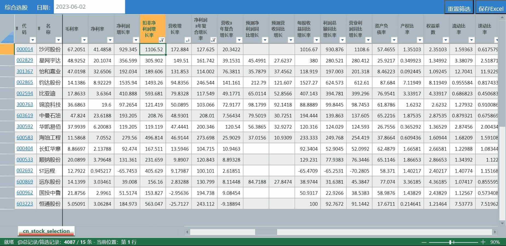
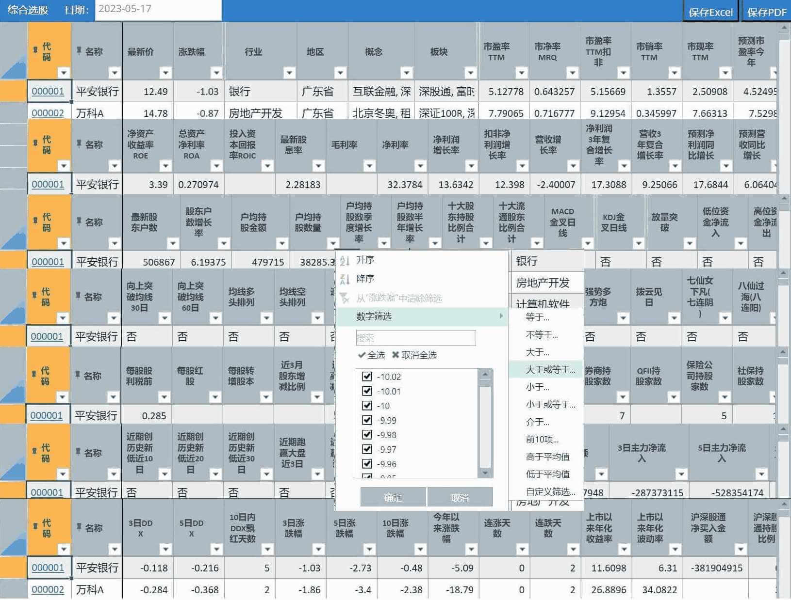

##  二：股票每日数据

包括每日股票数据、股票资金流向、股票分红配送、股票龙虎榜、股票大宗交易、股票基本面数据、行业资金流向、概念资金流向、早盘抢筹数据、尾盘抢筹数据、涨停原因揭密、每日ETF数据。

抓取A股票每日数据，主要为一些关键数据，同时封装抓取方法，方便扩展系统获取个人关注的数据。

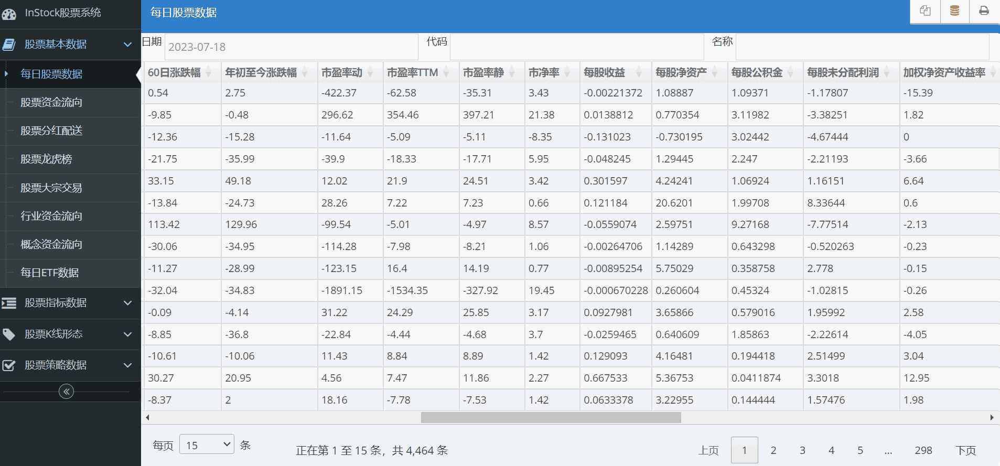
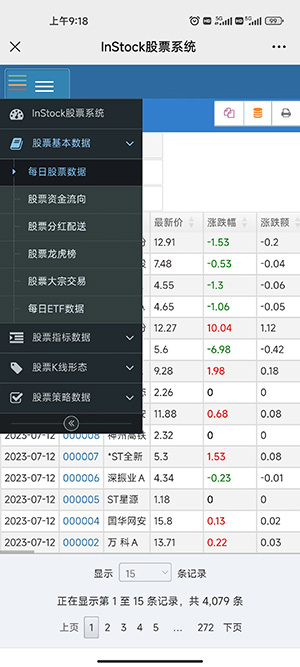
## 三：股票指标计算
基于talib、pandas 计算指标，计算高效准确。调整个别指标公式，确保结果和同花顺、通信达结果一致。
指标：

```
1、MACD 2、KDJ 3、BOLL 4、TRIX，TRMA 5、CR 6、SMA 7、RSI 
8、VR，MAVR 9、ROC 10、DMI，+DI，-DI，DX，ADX，ADXR 11、W&R 
12、CCI 13、TR、ATR 14、DMA、AMA 15、OBV 16、SAR 17、PSY 
18、BRAR 19、EMV 20、BIAS 21、TEMA  22、MFI 23、VWMA
24、PPO 25、WT 26、Supertrend  27、DPO  28、VHF  29、RVI
30、FI 31、ENE 32、STOCHRSI
```

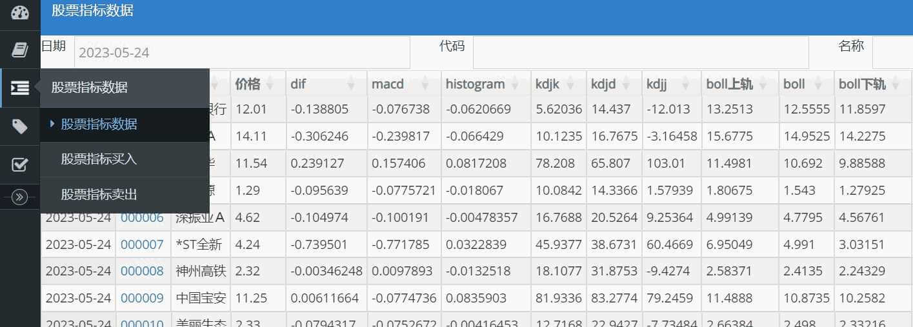
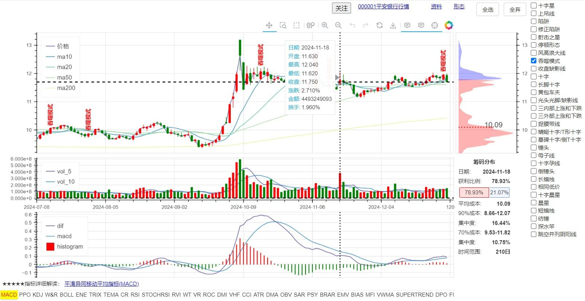

## 四：判断买入卖出的股票

根据指标判定可能买入卖出的股票，具体筛选条件如下：


```
KDJ:
1、超买区：K值在80以上，D值在70以上，J值大于90时为超买。一般情况下，股价有可能下跌。投资者应谨慎行事，局外人不应再追涨，局内人应适时卖出。
2、超卖区：K值在20以下，D值在30以下为超卖区。一般情况下，股价有可能上涨，反弹的可能性增大。局内人不应轻易抛出股票，局外人可寻机入场。
RSI:
1、当六日指标上升到达80时，表示股市已有超买现象，如果一旦继续上升，超过90以上时，则表示已到严重超买的警戒区，股价已形成头部，极可能在短期内反转回转。
2、当六日强弱指标下降至20时，表示股市有超卖现象，如果一旦继续下降至10以下时则表示已到严重超卖区域，股价极可能有止跌回升的机会。
CCI:
1、当CCI＞﹢100时，表明股价已经进入非常态区间——超买区间，股价的异动现象应多加关注。
2、当CCI＜﹣100时，表明股价已经进入另一个非常态区间——超卖区间，投资者可以逢低吸纳股票。
CR:
1、跌穿a、b、c、d四条线，再由低点向上爬升160时，为短线获利的一个良机，应适当卖出股票。
2、CR跌至40以下时，是建仓良机。
WR:
1、当％R线达到20时，市场处于超买状况，走势可能即将见顶。
2、当％R线达到80时，市场处于超卖状况，股价走势随时可能见底。
VR:
1、获利区域160－450根据情况获利了结。
2、低价区域40－70可以买进。
```

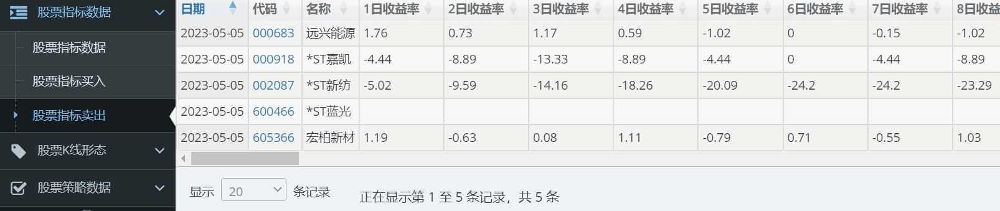

## 五：K线形态识别

精准识别61种K线形态，支持用户自选形态识别。

识别形态:

```
1、两只乌鸦2、三只乌鸦3、三内部上涨和下跌4、三线打击5、三外部上涨和下跌6、南方三星7、三个白兵8、弃婴
9、大敌当前10、捉腰带线11、脱离12、收盘缺影线13、藏婴吞没14、反击线15、乌云压顶16、十字17、十字星
18、蜻蜓十字/T形十字19、吞噬模式20、十字暮星  21、暮星22、向上/下跳空并列阳线23、墓碑十字/倒T十字
24、锤头25、上吊线26、母子线27、十字孕线28、风高浪大线29、陷阱30、修正陷阱31、家鸽32、三胞胎乌鸦
33、颈内线34、倒锤头35、反冲形态36、由较长缺影线决定的反冲形态37、梯底38、长脚十字39、长蜡烛
40、光头光脚/缺影线 41、相同低价42、铺垫43、十字晨星44、晨星45、颈上线46、刺透形态47、黄包车夫
48、上升/下降三法49、分离线50、射击之星51、短蜡烛52、纺锤53、停顿形态54、条形三明治55、探水竿
56、跳空并列阴阳线57、插入58、三星59、奇特三河床60、向上跳空的两只乌鸦61、上升/下降跳空三法 
```
形态识别结果：
```
负：出现卖出信号
0：没有出现该形态
正：出现买入信号
```
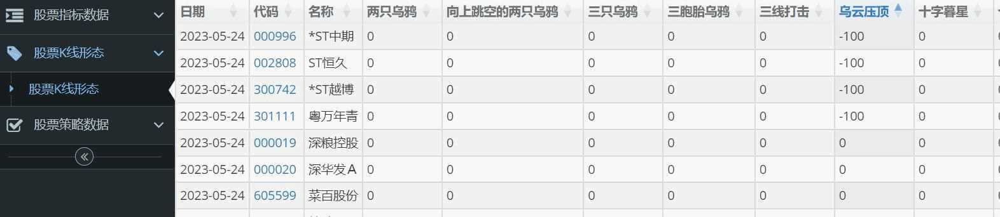
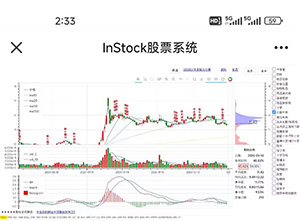

## 六：筹码分布

筹码分布通过计算一定时间范围内股票的:最高价、最低价、成交数，输出对应价格成交数占整个流通盘比值的分布图形。计算高效准确，结果与东方财富等专业软件的一致，缺省计算210个交易日的成本，可以自行设定时间范围。


## 七：策略选股

内置放量上涨、停机坪、回踩年线、突破平台、放量跌停等多种选股策略，同时封装了策略模板，方便扩展实现自己的策略。


```
1、放量上涨
    1）当日比前一天上涨小于2%或收盘价小于开盘价。
    2）当日成交额不低于2亿。
    3）当日成交量/5日平均成交量>=2。
2、均线多头
    MA30向上
    1）30日前的30日均线<20日前的30日均线<10日前的30日均线<当日的30日均线。
    2）(当日的30日均线/30日前的30日均线)>1.2。
3、停机坪
    1）最近15日有涨幅大于9.5%，且必须是放量上涨。
    2）紧接的下个交易日必须高开，收盘价必须上涨，且与开盘价不能大于等于相差3%。
    3）接下2、3个交易日必须高开，收盘价必须上涨，且与开盘价不能大于等于相差3%，且每天涨跌幅在5%间。
4、回踩年线
    1）分2个时间段：前段=最近60交易日最高收盘价之前交易日(长度>0)，后段=最高价当日及后面的交易日。
    2）前段由年线(250日)以下向上突破。
    3）后段必须在年线以上运行，且后段最低价日与最高价日相差必须在10-50日间。
    4）回踩伴随缩量：最高价日交易量/后段最低价日交易量>2,后段最低价/最高价<0.8。
5、突破平台
    1）60日内某日收盘价>=60日均线>开盘价。
    2）且【1】放量上涨。
    3）且【1】间之前时间，任意一天收盘价与60日均线偏离在-5%~20%之间。
6、无大幅回撤
    1）当日收盘价比60日前的收盘价的涨幅小于0.6。
    2）最近60日，不能有单日跌幅超7%、高开低走7%、两日累计跌幅10%、两日高开低走累计10%。
7、海龟交易法则
    最后一个交易日收市价为指定区间内最高价。
    1）当日收盘价>=最近60日最高收盘价。
8、高而窄的旗形
    1）必须至少上市交易60日。
    2）当日收盘价/之前24~10日的最低价>=1.9。
    3）之前24~10日必须连续两天涨幅大于等于9.5%。
9、放量跌停。
    1）跌>9.5%。
    2）成交额不低于2亿。
    3）成交量至少是5日平均成交量的4倍。
10、低ATR成长
    1）必须至少上市交易250日。
    2）最近10个交易日的最高收盘价必须比最近10个交易日的最低收盘价高1.1倍。
11、股票基本面选股
    1）市盈率小于等于20，且大于0。
    2）市净率小于等于10。
    3）净资产收益率大于等于15。
```

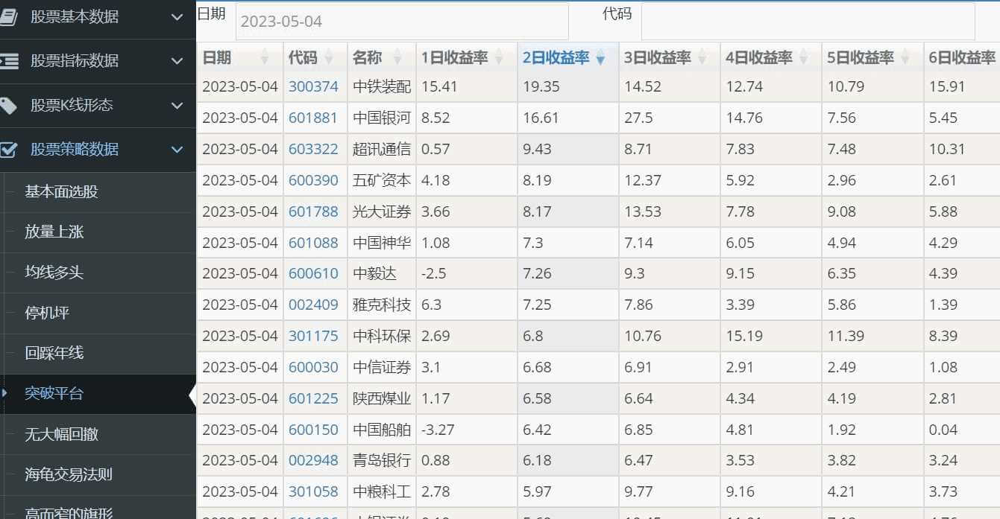

## 八：选股验证


对指标、策略等选出的股票进行回测，验证策略的成功率，是否可用。


## 九：自动交易

支持自动交易，内置自动打新股的策略及示例策略，由于**涉及金钱**，规避可能存在风险，没有提供其他交易策略。

具有交易日志，以及支持为每个交易策略配置交易日志。

**特别提醒**：交易日10:00点会触发打新，不想打新的删除stagging.py或不要启动“交易服务”。

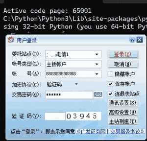

## 十：关注功能

支持股票关注，关注股票在各个模块(含有的)置顶、标红显示。

## 十一：支持批量


可以通过时间段、枚举时间、当前时间进行指标计算、策略选股及回测等。同时支持智能识别交易日，可以输入任意日期。

具体执行设置如下：
```
------整体作业，支持批量作业------
当前时间作业 python execute_daily_job.py
单个时间作业 python execute_daily_job.py 2022-03-01
枚举时间作业 python execute_daily_job.py 2022-01-01,2021-02-08,2022-03-12
区间时间作业 python execute_daily_job.py 2022-01-01 2022-03-01

------单功能作业，支持批量作业，回测数据自动填补到当前
基础数据实时作业 python basic_data_daily_job.py
基础数据非实时作业 python basic_data_other_daily_job.py
指标数据作业 python indicators_data_daily_job.py
K线形态作业 klinepattern_data_daily_job.py
策略数据作业 python strategy_data_daily_job.py
回测数据 python backtest_data_daily_job.py
```
## 十二：支持代理及Cookie

支持多代理获取数据。由于很多网站对大量请求有防护机制，使用单一IP地址频繁访问可能导致被封禁或限制访问。代理IP能够帮助分散请求来源，避免单一IP被封锁，从而保证爬虫程序的稳定运行。
支持注入Cookie，解决数据获取频率过高，限制数据获取。
## 十三：存储采用数据库设计

数据存储采用数据库设计，能保存历史数据，以及对数据进行扩展分析、统计、挖掘。系统实现自动创建数据库、数据表，封装了批量更新、插入数据，方便业务扩展。

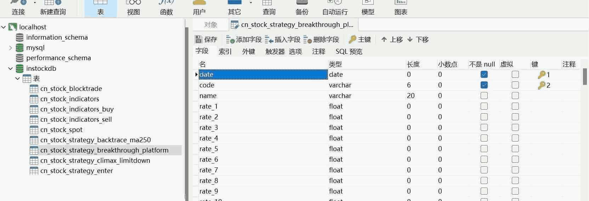

## 十四：展示采用web设计

采用web设计，可视化展示结果。对展示进行封装，添加新的业务表单，只需要配置视图字典就可自动出现业务可视化界面，方便业务功能扩展。

## 十五：运行高效


采用多线程、单例共享资源有效提高运算效率。1天数据的抓取、计算指标、形态识别、策略选股、回测等全部任务运行时间大概4分钟（普通笔记本），计算天数越多效率越高。


## 十六：方便调试

系统运行的重要日志记录在stock_execute_job.log(数据抓取、处理、分析)、stock_web.log(web服务)、stock_trade.log(交易服务)，方便调试发现问题。

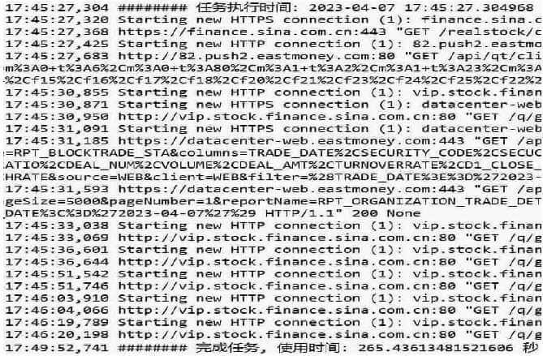


# 附属模组安装与运行

本项目不提供独立安装器、独立服务器部署或容器镜像。标准安装入口是 Newma-Desk 的 Mod Suite 与 External Mod Runtime：

1. 将本仓库放在 Newma-Desk 可发现的项目根目录下，默认目录名为 `stock-czsc-integration`；也可以设置 `NEWMA_DESK_INSTOCK_WORKSPACE`。
2. 在本项目中创建 Python 3.12 `.venv`，按 `requirements-attached.txt` 安装并应用 `requirements-attached.constraints.txt`，这是 Desk 托管运行时使用的隔离环境；`requirements.txt` 只用于上游完整诊断。
3. 在 Newma-Desk 中安装 `integrations/newma-desk/instock-suite/suite.json` 与 `integrations/newma-desk/data-service.json`。本地文件或运行中服务的 HTTP Suite Discovery 可直接导入；Git Store 只有在当前成果合并并发布到其声明的远程引用后才能获取。
4. 从 Newma-Desk 根目录运行 `npm run dev:stack`；Desk 自动启动或复用 `instock-analysis`，并通过 `/api/v1/health` 检查状态。
5. 使用 `npm run dev:status -- --strict`、`npm run mods:compat` 和 `npm run mods:certify -- --mod instock-czsc,instock-rotation` 完成当前已登记 Mod 的验收；其余 8 个页面已经包含在本项目 Suite 和在线页面合同中，待宿主正常导入 Suite 后，再由宿主对新登记的 Mod 执行相同运行认证。本项目不会绕过宿主流程自行改写 Desk Mod Store。

运行时只监听 Desk 配置的本地地址，跳过数据库和交易服务。行情、行业数据、Action、Agent Context 与权限全部由 Newma-Desk 提供。直接执行 `instock/web/web_service.py` 仅用于项目维护者诊断，不属于用户安装、生产启动或发布流程。

上游 InStock 的批处理、选股、MySQL 与自动交易说明仅作为源码背景保留，不属于 `instock-suite` 的支持边界。
# 特别声明

股市有风险投资需谨慎，本系统只能用于学习、股票分析，投资盈亏概不负责。

本系统中的表格为第三方商业控件，仅使用了评估版进行学习及测试。
