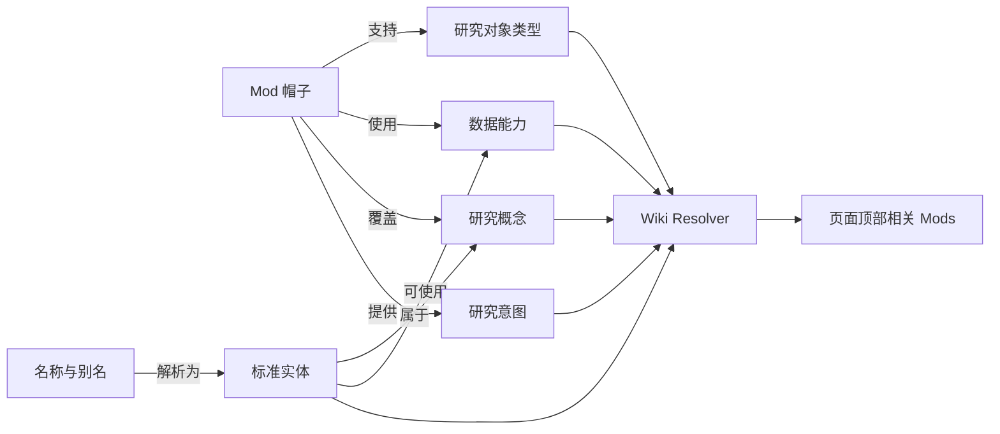

# LMM Wiki：Mod 连接架构与 MVP

## 1. 定义修正

这里的“帽子”就是 **Mod**。

同一个研究对象可以戴上多个 Mod：

- 市场概览 Mod：看行情和市场位置。
- 日线事件 Mod：看价格与事件的时间关系。
- 新闻 Mod：看舆情和新闻变化。
- CZSC Mod：看技术结构。
- 个股研究 Mod：看公司基本面。
- 产业链 Mod：看上下游和相关概念。

因此 Wiki 的核心不是另外创建一套“帽子”，而是把多个 Mod 与共同的实体、名称、概念和数据能力连接起来。

## 2. 当前工程基础

基于当前运行中的 Newma-Desk：

- 已发布 Mod：73 个。
- Manifest 1.1：61 个；Manifest 1.0：12 个。
- 外部运行时 Mod：66 个。
- 已统一发送和接收 `security.selected`：27 个。
- 已注册数据能力：28 个。
- 数据服务：4 个。
- 声明 Actions 的 Mod：30 个。
- 声明 Data Services 的 Mod：33 个。

这意味着：

- Mod 注册表、数据能力目录、页面上下文和事件总线已经存在，可以直接复用。
- 自动索引全部 Mod 并不困难。
- 真正困难的是名称消歧、概念标准化，以及让不同外部运行时可靠接收同一种上下文。

## 3. Wiki 的基本原理

Wiki 不是静态链接表，也不是把全部行情、新闻和财报复制进一个图数据库。

它是一套持续更新的**语义索引和路由系统**：



系统通过四类共同连接点，把 Mod 串起来。

### 3.1 标准实体

实体是当前正在研究的对象。

```ts
interface WikiSubjectRef {
  type:
    | "security"
    | "etf"
    | "fund"
    | "company"
    | "industry"
    | "concept"
    | "event"
    | "topic";
  canonicalId: string;
  displayName: string;
  market?: "CN" | "HK" | "US";
  symbol?: string;
  assetType?: string;
}
```

推荐 ID：

- `security:CN:300308`：中际旭创股票。
- `etf:CN:512010`：医药 ETF。
- `fund:CN:003562`：开放式基金。
- `industry:SW1:通信`：申万一级通信行业。
- `concept:CN:CPO`：CPO 概念。

`canonicalId` 必须包含对象类型和市场，不能只使用六位代码。否则会再次出现股票、ETF、基金被错误识别为同一对象的问题。

### 3.2 名称与别名

名称不是独立研究对象，而是进入标准实体的入口。

```text
中际旭创 ─┐
300308   ─┼─> security:CN:300308
ZJXC     ─┤
中际旭創 ─┘
```

别名索引至少保存：

- 原始名称和标准名称。
- 股票、ETF、基金代码。
- 中文简称、全称、旧名称。
- 拼音首字母和常见英文名。
- 市场与资产类型约束。
- 来源、更新时间和置信度。

名称解析顺序：

1. 代码 + 市场 + 资产类型精确匹配。
2. 标准名称精确匹配。
3. 别名和拼音匹配。
4. 多结果时要求用户选择，不能由 Agent 猜测资产类型。

### 3.3 概念

概念用于建立间接关系，例如：

```text
中际旭创 -> CPO -> AI 算力 -> 光通信产业链
医药 ETF -> 医药生物 -> 创新药
```

概念关系可以连接：

- 实体与概念。
- Mod 与概念。
- 概念与概念。

概念只能用于扩大候选和排序，不能单独决定跳转。目标 Mod 仍必须明确支持当前对象类型。

### 3.4 数据能力

Wiki 连接的是数据能力，不保存大体量实时数据本身。

现有能力包括：

- `market.quote`
- `market.ohlcv`
- `market.news`
- `market.announcements`
- `market.reports`
- `analysis.czsc`
- `analysis.rotation`
- `research.catalysts`
- `fund.search`
- `fund.analysis.run`

例如：

```text
CZSC Mod --使用--> market.ohlcv
新闻 Mod --使用--> market.news
日线事件 Mod --使用--> market.ohlcv + market.news + market.announcements
```

这些关系大部分可以直接从现有 Manifest `actions`、`dataServices` 和数据能力目录自动生成，不需要 Agent 推断。

## 4. Mod 的 Wiki Profile

每个 Mod 需要一份机器可读的 Wiki Profile。`wiki` 是向后兼容的可选字段，直接扩展 Manifest 1.1，并由 `wiki.contractVersion` 独立管理版本，避免为新增元数据升级全部 Mod Manifest。

```json
{
  "schemaVersion": "1.1",
  "id": "instock-czsc",
  "wiki": {
    "contractVersion": "1.0",
    "subjectTypes": ["security", "etf"],
    "concepts": ["technical-analysis", "czsc"],
    "entrypoints": [
      {
        "id": "structure",
        "intent": "technical.structure",
        "label": "CZSC 结构",
        "contextContract": "newma.wiki.subject.v1",
        "defaults": {
          "period": "daily",
          "bars": 480
        }
      }
    ]
  }
}
```

其中：

- `subjectTypes`：Mod 能处理什么对象。
- `concepts`：Mod 对应的研究领域，不是当前标的所属概念。
- `entrypoints`：这个 Mod 可以从 Wiki 进入的功能入口。
- `intent`：进入后要完成的研究动作。
- `contextContract`：目标 Mod 接收的上下文版本。
- `defaults`：周期等非敏感默认值。

以下内容不写入 Profile：

- 域名和端口。
- 完整目标 URL。
- 数据服务 Token。
- Agent 临时推断出的可执行参数。

## 5. Wiki 索引如何建立

索引分为三层，权威级别不能混在一起。

### 5.1 权威层

来源：Mod Manifest、数据能力注册表、Mod 发布状态、权限和运行健康。

自动生成：

- Mod 提供的入口。
- Mod 支持的对象类型。
- Mod 使用的数据能力。
- Mod 当前 Revision。
- Mod 是否可用。

这部分实时更新，不依赖 Agent。

### 5.2 标准化层

来源：证券搜索、基金搜索、行业分类和概念数据源。

生成：

- 名称和代码到标准实体的映射。
- 股票、ETF、基金的资产类型。
- 实体与行业、概念的关系。
- 别名和历史名称。

### 5.3 Agent 增强层

Agent 定期扫描全部 Mod 和缺失关系，补充：

- Mod 的概念标签。
- 能力之间的互补关系。
- 新出现的名称和概念别名。
- 产业链和主题关系。
- 过期关系提示。

Agent 生成的关系必须保存：

```ts
interface WikiAssertion {
  source: "agent";
  confidence: number;
  evidence: string[];
  createdAt: string;
  expiresAt?: string;
  status: "pending" | "accepted" | "rejected";
}
```

Agent 不能：

- 修改 Manifest 声明的可执行入口。
- 把未接入 Handoff 的 Mod 标记为可跳转。
- 绕过权限和健康状态。
- 在用户点击时临时生成 URL。

## 6. 页面如何得到相关 Mod

当前 Mod 发布统一 Wiki Context：

```ts
interface WikiPageContext {
  primarySubject: WikiSubjectRef;
  relatedSubjects?: WikiSubjectRef[];
  conceptIds?: string[];
  intent: string;
  timeframe?: string;
  snapshotId?: string;
}
```

中际旭创示例：

```json
{
  "primarySubject": {
    "type": "security",
    "canonicalId": "security:CN:300308",
    "displayName": "中际旭创",
    "market": "CN",
    "symbol": "300308",
    "assetType": "stock"
  },
  "conceptIds": ["concept:CN:CPO", "topic:AI算力"],
  "intent": "market.overview",
  "timeframe": "daily",
  "snapshotId": "market-daily:181b7eb7"
}
```

Resolver 的处理顺序：

1. 找出明确支持 `security` 的 Mod。
2. 排除当前 Mod、已禁用 Mod、无权限 Mod 和不健康 Mod。
3. 检查目标 Mod 是否有可用 Entry Point 和 Handoff 合同。
4. 按当前意图寻找互补能力。
5. 使用共同概念和共同数据能力调整顺序。
6. 返回 3–5 个顶部入口和完整的“更多 Mods”列表。

必须满足的硬条件：

```text
支持当前对象类型
+ 存在可用入口
+ 支持上下文交接
+ Mod 当前健康
= 可以显示为跳转按钮
```

概念、名称相似度和 Agent 判断只能加分，不能替代硬条件。

## 7. 推荐评分

MVP 使用确定性评分，不让 LLM 参与在线请求。

```text
对象类型精确匹配       35
研究意图互补           25
目标入口可完整恢复     15
共同概念               10
共同或相邻数据能力      5
用户最近使用            5
数据与 Mod 健康度       5
```

推荐理由必须可解释：

- “同一标的，可查看日线事件”。
- “同一 ETF，可查看 CZSC 日线结构”。
- “中际旭创属于 CPO 概念，可进入产业链研究”。
- “当前页面使用行情数据，新闻 Mod 可补充事件解释”。

## 8. 跳转与上下文交接

Wiki 不返回完整运行时 URL，而是返回目标 Mod 和入口：

```ts
interface WikiLink {
  id: string;
  targetModId: string;
  targetRevision: number;
  entrypointId: string;
  label: string;
  reason: string;
  score: number;
}
```

点击后由 Desk 创建 Handoff：

```ts
interface WikiHandoff {
  version: 1;
  id: string;
  sourceModId: string;
  sourceSnapshotId?: string;
  targetModId: string;
  entrypointId: string;
  subject: WikiSubjectRef;
  relatedSubjects?: WikiSubjectRef[];
  conceptIds?: string[];
  intent: string;
  timeframe?: string;
  parameters?: Record<string, string | number | boolean>;
  expiresAt: string;
}
```

流程：

1. Shell 请求 Wiki Resolver。
2. 页面顶部显示相关 Mod。
3. 用户点击其中一个入口。
4. Shell 创建短期 Handoff。
5. Shell 切换到目标 Mod。
6. 目标 Mod 完成 Bridge 握手后接收 Handoff。
7. 目标 Mod 恢复标的、类型、周期和入口状态。
8. 目标 Mod 确认成功后消费 Handoff。

复制链接时，Desk URL 只携带短期 ID：

```text
/?mod=instock-czsc&handoff=hf_abc123
```

现有 `security.selected` 继续负责已经加载页面之间的轻量同步。跨 Mod 导航使用 Handoff，避免目标尚未加载时事件丢失。

## 9. MVP 范围

### 9.1 支持对象

首版支持：

- A 股股票。
- 场内 ETF。
- 开放式基金。
- 行业和概念作为关联节点。

开放式基金可以参与 Wiki，但只推荐明确声明支持 `fund` 的 Mod，不能因为代码同为六位就进入股票 Mod。

### 9.2 首批接入 Mod

建议选择六个代表性 Mod：

1. `market-daily`：市场概览。
2. `event-timeline`：日线事件。
3. `news-radar`：新闻与舆情。
4. `instock-czsc`：技术结构。
5. `stock-research`：个股研究。
6. `industry-map`：产业链与概念研究。

基金类再选择一个现有基金研究 Mod 作为第七个试点，用于验证 `fund` 与股票、ETF 的严格隔离。

### 9.3 索引范围

- 自动读取全部 73 个已发布 Mod。
- 自动读取全部 28 个数据能力。
- 所有 Mod 都可进入 Wiki 搜索索引。
- 只有声明 Wiki Entry Point 且完成 Handoff 的试点 Mod 才显示为顶部跳转按钮。

这一区分很重要：**可被发现，不等于可以跳转。**

### 9.4 Agent 范围

MVP 中 Agent 只执行离线任务：

- 每日扫描 Mod 新增、删除和描述变化。
- 给缺少概念标签的 Mod 生成建议。
- 发现新的名称和概念别名。
- 标记待复核关系。

在线推荐不调用 Agent，避免速度、费用和结果漂移。

### 9.5 MVP 不做

- 不引入 Neo4j 等图数据库。
- 不复制实时行情、新闻正文和财报数据。
- 不要求一次改造全部 73 个 Mod。
- 不做复杂多跳知识推理。
- 不做 Agent 自动修改 Manifest。
- 不根据模糊名称自动猜股票或基金。
- 不允许 Mod 自己拼接其他 Mod 的 URL。

## 10. MVP 存储模型

首版继续使用 SQLite，采用明确表结构，不使用通用 EAV 图表。

```text
wiki_mod_profiles
wiki_mod_entrypoints
wiki_subjects
wiki_subject_aliases
wiki_concepts
wiki_subject_concepts
wiki_mod_concepts
wiki_mod_data_capabilities
wiki_intent_relations
wiki_assertions
wiki_handoffs
wiki_link_feedback
```

权威数据可随时从 Manifest 和数据目录重建。Agent 关系、别名和反馈才需要持久化。

## 11. MVP API

```text
POST   /api/wiki/link-resolutions
POST   /api/wiki/handoffs
GET    /api/wiki/handoffs/{handoffId}
DELETE /api/wiki/handoffs/{handoffId}
GET    /api/wiki/subjects?query=中际旭创&type=security&market=CN
GET    /api/wiki/mod-profiles
GET    /api/wiki/mod-profiles/{modId}
POST   /api/wiki/index-runs
POST   /api/wiki/link-feedback
```

`link-resolutions` 请求当前页面上下文，返回一次可解释的候选集合。点击后再创建 Handoff，避免为未点击的推荐创建大量临时数据。

## 12. 现有代码的主要改动

### 合同层

- `packages/contracts/src/module.ts`
  - Manifest 1.1 可选 Wiki Profile。
  - `wiki.subjectTypes`、`wiki.concepts`、`wiki.entrypoints`。
- `packages/contracts/src/bridge.ts`
  - `ModPageContext.wiki`。
  - `vibedesk:handoff` 和 `vibedesk:handoff-result`。
- `packages/module-sdk/src/host.ts`
  - `publishWikiContext()`。
  - `onHandoff()`。

### 服务端

- 新增 `services/api/vibe_visualization_api/wiki/`。
- 从 Mod Repository 和 Data Service Registry 构建索引。
- Mod 发布、禁用、安装和卸载后增量更新 Profile。
- 启动时做一次全量核对，修复漏掉的事件更新。
- 将现有 Scheduler 抽象为通用任务注册表，增加 Wiki Agent 任务。

### Shell

- `apps/shell/src/App.tsx`
  - 保存当前 Wiki Context、候选链接和待处理 Handoff。
- `apps/shell/src/components/ModuleFrame.tsx`
  - 在统一顶部栏展示相关 Mod。
  - 目标 Mod握手后发送 Handoff。
- 新增 `apps/shell/src/api/wiki.ts`。

### 试点 Mod

- 发布标准实体，而不是只发布 `symbol/name`。
- 声明可接收的对象类型。
- 实现 Handoff 恢复。
- CZSC 不再依赖页面之间手工拼接长 URL。

## 13. 实施难度

| 工作项 | 难度 | 主要原因 |
|---|---:|---|
| 从 73 个 Manifest 建立 Mod 索引 | 中 | 注册表已经存在，主要是版本兼容和增量更新 |
| 关联 28 个数据能力 | 低到中 | 已有统一 Data Service Catalog |
| 股票、ETF、基金名称消歧 | 高 | 六位代码可能重合，外部源分类也可能错误 |
| 行业和概念标准化 | 高 | 分类体系、别名和更新时间不统一 |
| 确定性推荐排序 | 中 | 规则清楚，但要避免所有 Mod 互相推荐 |
| Shell 顶部推荐栏 | 中 | 已有统一 `ModuleFrame` 工具栏 |
| 可靠 Handoff | 中到高 | 66 个外部运行时，加载和握手生命周期不同 |
| Agent 定期增强 | 中到高 | 要管理证据、置信度、过期和人工覆盖 |
| 全部 73 个 Mod 接入 | 高 | 需要逐个运行时或共享框架适配 |

## 14. 工作量评估

假设一名熟悉当前工程的全栈工程师，数据服务不做大规模重构：

| 阶段 | 工作量 |
|---|---:|
| Manifest、Context、Handoff 合同 | 2–3 人日 |
| Wiki SQLite 索引与 API | 3–4 人日 |
| 股票、ETF、基金名称解析 | 3–4 人日 |
| Resolver 与可解释评分 | 2–3 人日 |
| Shell 顶部栏与导航状态 | 2–3 人日 |
| 六至七个试点 Mod适配 | 4–6 人日 |
| Agent 离线扫描和建议 | 2–3 人日 |
| 联调与关键验收 | 2–3 人日 |

可用 MVP 合计：**20–29 人日**，单人约 4–6 周。

如果两人并行负责“合同与后端”和“Shell 与试点 Mod”，预计 2.5–4 周。

只做演示原型可以压缩到 7–10 人日，但会缺少可靠 Handoff、完整名称消歧和 Agent 维护，不应直接作为正式架构上线。

全部 73 个 Mod 完成可跳转适配，预计还需要 **4–8 周**。实际时间取决于这些外部运行时是否共享 SDK 和页面框架。

## 15. 主要风险

### 15.1 错误实体传播

一旦把基金代码识别成股票，错误会传播到所有 Mod。

措施：标准 ID 必须包含类型和市场；多结果必须选择；禁止只凭六位代码跳转。

### 15.2 概念污染

Agent 可能把宽泛概念连接到过多实体和 Mod。

措施：概念只参与排序；保存证据、置信度和有效期；低置信关系默认待审核。

### 15.3 数据能力与页面能力混淆

拥有 `market.news` 数据不代表 Mod 一定提供“新闻研究页面”。

措施：数据能力自动索引，页面入口必须由 Wiki Entry Point 明确声明。

### 15.4 外部 Mod 无法恢复上下文

页面能打开，但未必能自动定位到目标标的。

措施：只有通过 Handoff 验证的 Mod 才获得 `launchable` 状态。

### 15.5 Agent 成为在线依赖

Agent 不可用时可能导致所有推荐失效。

措施：权威索引和在线 Resolver 完全确定性运行；Agent 只做异步增强。

## 16. MVP 验收标准

### 实体正确性

- 搜索“中际旭创”、`300308`、`zjxc` 指向 `security:CN:300308`。
- `512010` 始终识别为 ETF。
- 开放式基金不会进入只支持股票的 Mod。
- 有歧义的名称不自动选错。

### 自动发现

- 安装或发布一个声明 Wiki Profile 的新 Mod 后，无需修改 Shell 代码即可出现。
- 禁用或卸载 Mod 后，入口立即消失。
- 数据能力目录变化后，关联索引自动更新。

### 跳转

- 中际旭创可在市场概览、日线事件、新闻、CZSC、个股研究和产业链之间切换。
- 医药 ETF 可进入明确支持 ETF 的相关 Mod。
- 跳转后标的类型、代码、名称、周期和来源快照不丢失。
- 目标 Mod 不可用时不展示或明确提示，不能进入空白页面。

## 17. 当前落地进度

已完成：

- Manifest Wiki Profile、标准页面 Context、顶部推荐和短期 Handoff。
- 市场概览、日线事件、新闻、CZSC、个股研究、产业链研究互联。
- 基金与 ETF 研究接入，ETF 与开放式基金使用不同标准 ID 和数据路径。
- `GET /api/wiki/subjects` 实体解析接口：统一代码、名称、资产类型和已确认别名。
- 页面发布 Wiki Context 时，自动沉淀实体与行业/概念关系。
- 实体索引使用 SQLite；模糊名称仍由权威证券搜索补全，单一结果才保存查询别名。

下一步：

- 在 Desk 全局搜索与 Mod 顶部“更多研究”中接入实体搜索。
- 增加申万行业、概念分类和历史名称的定期同步。
- 增加 Agent 离线扫描任务，只生成待复核标签和别名建议。

### Agent 管理

- Agent 可以发现缺失标签并生成待审核建议。
- Agent 建议保存来源、证据和置信度。
- Agent 失败不影响现有 Wiki 链接。

## 17. 推荐实施顺序

1. 先解决标准实体和资产类型，彻底堵住股票、ETF、基金混淆。
2. 定义 Manifest 1.1 Wiki Profile 和页面 Wiki Context。
3. 建立确定性 Mod/Data 索引与 Resolver。
4. 完成 Shell 顶部入口和可靠 Handoff。
5. 接入六至七个试点 Mod。
6. 最后增加 Agent 的概念和别名增强。

最关键的 MVP 不是“让 Agent 自动连一切”，而是先保证：

> 同一个标准研究对象，可以安全、准确、可解释地切换到另一顶 Mod 帽子。

## 18. 2026-08-15 实施状态

第二阶段试点已形成可运行闭环：

- Manifest 1.1 已支持可选 `wiki` Profile，Manifest 1.0 会拒绝 Wiki 等 1.1 字段。
- `ModPageContext`、Bridge 与 Module SDK 已支持 Wiki Context 和 Handoff。
- Resolver 直接读取当前已发布 Mod 与数据能力目录，不维护第二份静态链接表。
- Handoff 使用 SQLite 保存，按用户和工作区隔离，默认 5 分钟过期。
- Shell 顶部统一展示相关 Mod；目标 Mod 握手后投递 Handoff，成功后删除记录并清理 URL。
- 页面刷新时可以恢复尚未完成的 Handoff。
- 已完成 `market-daily`、`event-timeline`、`news-radar`、`instock-czsc`、`stock-research`、`industry-map` 六个试点 Mod。

当前发布版本：

| Mod | 版本 | Revision |
|---|---:|---:|
| `market-daily` | 0.4.0 | 10 |
| `event-timeline` | 0.4.0 | 11 |
| `news-radar` | 0.3.0 | 14 |
| `instock-czsc` | 0.2.1 | 9 |
| `stock-research` | 0.3.0 | 12 |
| `industry-map` | 0.3.0 | 11 |

浏览器验收已经覆盖：

- CZSC → 新闻 → 市场终端 → 日线时间轴的连续跳转。
- 场内 ETF `512010` 从时间轴进入 CZSC 后，代码、名称和 ETF 类型保持不变。
- 开放式基金支持中文名称搜索；基金只在日线时间轴与新闻之间互相推荐，不出现 CZSC 或市场终端。
- Handoff 成功后 URL 不残留 `handoff` 参数。
- CZSC Context 不再发布合同外的 `data.snapshot` 顶层字段；宿主与 Mod 的 `asOf`、`refresh` 能力合同已同步。
- 个股研究可以恢复股票代码、名称和市场，并把真实板块与概念发布为 Wiki Context。
- 产业链研究接收股票后，会使用标的板块与热门概念自动匹配现有产业链；`300308` 当前精确进入“光模块与光互联”。
- 市场终端、日线事件、新闻、CZSC、个股研究与产业链之间均已出现自动顶部入口。

下一阶段仍未完成：

- 独立的名称、别名、行业和概念索引。
- Agent 定期生成带证据、置信度和有效期的待审核关系。
- Resolver 接入运行健康、用户权限、最近使用和反馈权重。
- 基金研究 Mod 的正式 Handoff 接入。
- “更多相关 Mods”、关系反馈和索引运行管理接口。
