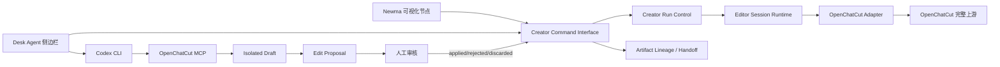

# Newma Creator Studio × OpenChatCut 整合审核与架构

日期：2026-08-23

## 1. 结论

采用“完整保留 OpenChatCut 上游 + Newma 薄 Adapter”。

不拆 OpenChatCut 核心源码，不在 Newma 内重写时间线、EditorCore Command、MCP 会话、工程存储、模板库和 Undo。Newma 只掌握任务、节点、审核、交付物、跨节点流转和状态投影。

这条路线上线更快，整合度也更高。拆出局部 UI 虽然能快速做出演示，但会断开“人工时间线—Agent Draft—提案审核—原子提交—Undo—模板—导出”的内部一致性，后续更新和故障排查成本更高。

## 2. 流程纠正

1. 当前 Registry 是 **6 个 Stage、29 个核心 Node**。真人口播、VOX、无头口播、数字人、广告片、电影短剧是“生产通路模板”，不应复制成六套平行 Node 链。
2. OpenChatCut 是 `transwrite/manual_edit` 的主编辑器，不应嵌入所有 Node。其他 Node 按 Capability Adapter 调用最佳仓库或 Skill，避免 29 套前端和运行时。
3. “超市选中模板”只表示绑定节点，不表示已改动时间线。真实应用必须由 OpenChatCut `manage_template list_assets → apply` 执行。
4. “保存为模板”不能只在 Newma 生成一个 preset。必须先由 OpenChatCut `manage_template save` 返回稳定 ID，Newma 再登记引用。
5. Agent 不能绕过 OpenChatCut 直接写工程文件。所有剪辑只进入隔离 Draft，人工审核后才进入正式时间线。

## 3. 主架构



核心 Seam 只保留三个：

- `Creator Command Interface`：页面和 Agent 共用。
- `Editor Session Runtime`：屏蔽 OpenChatCut、HTML Video、分镜审核等编辑器差异。
- `Capability Adapter`：屏蔽 CLI、Skill、生成 Provider、发布连接器差异。

## 4. 真实协同剪辑协议

```text
manual_edit
→ Creator Editor Session
→ 打开 OpenChatCut 人工时间线
→ 绑定并持久化 OpenChatCut Project ID
→ 打开 Desk Agent，预填剪辑要求，用户确认发送
→ Codex 动态注入 OpenChatCut MCP
→ openchatcut_status / target_project
→ begin_edit_session(approvalMode=manual)
→ read_project / load_skill / Draft 编辑
→ review_edit_session
→ 保持 MCP 连接并轮询 get_edit_session
→ 用户在 OpenChatCut 应用或拒绝
→ Agent 输出 creator.editor.review-proposal UI Action
→ Newma 登记终态
→ OpenChatCut 导出完成后输出 creator.editor.import-export
→ Newma 固化 edited_master、edit_decisions、timeline_exchange 并回写 Artifact Lineage
```

安全约束：

- Token 读取顺序：`NEWMA_DESK_OPENCHATCUT_MCP_TOKEN` → `OPENCHATCUT_MCP_TOKEN` → `~/.openchatcut/mcp-token`。
- Token 只进入 Codex 子进程环境，不进入命令行、页面 Context、日志、Artifact 或 preset。
- 协同剪辑时 Codex 文件系统沙箱固定为 `read-only`。
- Newma 不相信页面传入的 MCP URL；URL 只来自 Runtime Descriptor 环境配置。

## 5. Runtime 单一事实源

`config/external-mod-runtimes.json` 掌握：

- OpenChatCut 工作区发现。
- Web origin。
- MCP origin、Interface Path 和独立 Health Path。
- Desk 子进程环境投影。

Creator Studio 媒体注册表只保留编辑器 Capability、启动候选命令、产物契约和模板目录。MCP 地址统一从 `NEWMA_DESK_OPENCHATCUT_MCP_ORIGIN` 派生。

Desk 开发栈使用 Node 24 启动 `dev:shared`，避免 Whisper 预编译拖慢启动。OpenChatCut 是 Optional External Editor Runtime，不得拖垮 Desk 核心。

## 6. 29 个 Node 的最佳能力选型

| Stage / Node | 主 Module / Adapter | 主要仓库、Skill 或依赖 | 核心交付物 |
| --- | --- | --- | --- |
| Intake / 来源配置 | Source Intake Adapter | Playwright / Browser、media-downloader、Agent Reach | `source_plan`、`source_material_index` |
| Intake / 采集入库 | Collector Adapter | MediaCrawlerPro、we-mp-rss、yt-dlp/gallery-dl、Firecrawl | `intake_records`、`raw_assets`、`source_receipts` |
| Intake / 清洗归一 | Normalization Module | trafilatura/readability、去重与来源追踪、HTML Anything 审阅 | `normalized_records`、`duplicate_report` |
| Intake / 采集审核 | Review Gate | data-quality-checker、覆盖率/缺口检查 | `intake_review`、`brief_handoff` |
| Brief / 事件归并 | Event Cluster Module | TrendRadar、NewsNow、alphaear-news/search | `event_clusters`、`source_matrix` |
| Brief / 选题池 | Topic Design Session | newma-hotspot-radar、多角度 Agent、HTML Anything 卡片 | `topic_cards`、`topic_ranking` |
| Brief / 研究 Brief | Research Planning Session | finance-data-router、policy-monitor、官方数据源、反证设计 | `brief_manifest`、`research_plan`、`evidence_gaps` |
| Brief / 选题审核 | Brief Gate | Claim/Evidence Gate、研究缺口检查 | `selected_topics`、`draft_handoff` |
| Draft / 证据底稿 | Evidence Module | FRED/IMF/PBOC/交易所、新闻检索、finance Skills、图表脚本 | `evidence_ledger`、`data_tables`、`citation_index` |
| Draft / 文章结构 | Outline Session | Lemon DNA、论证结构、留存结构 | `article_outline`、`claim_order` |
| Draft / 长文写作 | Writing Session | lemon、baoyu-format-markdown、md2wechat、账号 DNA | `article_markdown`、`article_html`、`draft_manifest` |
| Draft / 图表与配图 | Visual Package Session | baoyu-article-illustrator/cover/infographic、imagegen、Codex Image Bridge | `illustrated_article`、`asset_manifest`、`cover_candidates` |
| Draft / 初稿审核 | Draft Gate | DNA 对齐、Evidence Coverage、排版/图片 QC | `final_structure_snapshot`、`transwrite_handoff` |
| Transwrite / 通路选择 | Route Select Module | 六条 Pipeline Registry、Director Registry、成本/时长/素材匹配 | `transwrite_decision`、`lane_jobs` |
| Transwrite / 文章生产 | Article Build Session | HTML Anything、公众号预览、Claim/Evidence Ledger | `article_html_pack`、`article_style_dna` |
| Transwrite / 剧本重写 | Script Module | shorts/MrBeast 留存方法、口语化、证据对齐 | `video_script`、`retention_plan` |
| Transwrite / 导演分镜 | Director Module | video-shotcraft、video-spec-builder、shuohao-skills、BigBanana Director | `scene_plan`、`tool_routing_plan`、`storyboard_review` |
| Transwrite / 素材生产 | Asset Session | 官方/新闻素材、media-downloader、ComfyUI Copilot、imagegen、MiniMax CLI | `asset_manifest`、`renderer_asset_gate` |
| Transwrite / 人工剪辑 | Collaborative Editor Runtime | **OpenChatCut 主线**、OpenTimelineIO 交换、FireRed/FunClip/auto-editor 粗剪算子 | `edit_decisions`、`timeline_exchange`、`edit_proposal`、`project_template` |
| Transwrite / 渲染与 QC | Render Session | Remotion、html-video、HyperFrames/GSAP、FFmpeg、VBench | `review_render`、`contact_sheet`、`render_report` |
| Transwrite / 成片审核 | Delivery Gate | VBench、ViStoryBench、跨通路一致性/发布就绪检查 | `transwrite_manifest`、`publish_handoff` |
| Publish / 渠道包装 | Packaging Module | claude-shorts、baoyu-xhs-images、封面/文案适配 | `channel_packs`、`cover_pack`、`platform_copy` |
| Publish / 账号路由 | Account Session | Qianfan Account Console、账号健康和排期规则 | `account_routes`、`publish_schedule` |
| Publish / 发布预检 | Publish Preflight | 平台规则、尺寸/编码/声明、账号健康 | `publish_preflight_report` |
| Publish / 执行发布 | Publish Execution Module | social-auto-upload、biliup-rs、OpenCLI、Qianfan Publish Console | `publish_jobs`、`platform_receipts` |
| Publish / 回执验真 | Receipt Verification | 平台回执、公开页面核验、发布差异账本 | `publish_manifest`、`postmortem_handoff` |
| Postmortem / 数据回收 | Metrics Session | 平台 Analytics Adapter、指标归一 | `performance_dataset`、`platform_snapshot` |
| Postmortem / 效果归因 | Attribution Session | 留存/封面/选题/发布时间归因、实验分析 | `postmortem_report`、`experiment_findings` |
| Postmortem / 知识回写 | Learning Gate | Style Skill、Director Memory、发布策略更新 | `dna_updates`、`director_updates`、`publish_policy_updates` |
| Postmortem / 下一轮任务 | Next-cycle Module | 已跑通 Workflow Template、项目恢复点 | `next_cycle_plan`、`postmortem_manifest` |

## 7. 超市重构

超市不按“仓库、Skill、模板”技术名词堆叠，而按用户任务组织：

1. **当前节点推荐**：默认页，只展示与当前 Node 兼容的能力。
2. **生产通路**：真人口播、VOX、无头口播、数字人、广告片、电影短剧。
3. **场景模板**：开场钩子、人物介绍、图表、新闻截图、重点花字、下三分之一、引用、CTA。
4. **剪辑能力**：粗剪、字幕、音频、调色、B-roll、动画叠层、渲染和 QC。
5. **我的模板**：收藏预设、用户工程模板、已跑通项目、过往版本。
6. **开源实验室**：仓库、Skills、CLI 和 Provider 的技术视图，供教学和 PoC，不干扰普通用户。

每张卡必须显示：

- “它解决什么问题”。
- 当前登记、安装、运行和兼容状态。
- 适用 Stage / Node、输入、输出、依赖和预计成本。
- 预览图、示例成片或流程图。
- `试用演示`、`收藏`、`绑定节点`、`查看版本`四个核心操作。

### 模板三阶段生命周期

```text
剪辑前：超市收藏/选择 → 绑定 Workflow Node → pending_editor_application
剪辑中：OpenChatCut manage_template list_assets/apply → Draft 提案 → 人工审核
剪辑后：OpenChatCut manage_template save → 返回 stable template ID → Newma 登记引用和版本
```

“已跑通项目保存为模板”还应保存：Pipeline ID、Director ID、使用的模板 ID、关键参数、来源锁定、交付物契约、人工裁决和 QC 结果。媒体文件仍保留在 Artifact Store，不复制进 preset。

## 8. 上游更新策略

- 上游位置：`vendor/reserved/video/openchatcut`。
- 当前锁定 Commit：`320c07fd146c4068fc0ac62004b9e2818122d530`。
- 日常更新：在独立 Git 工作区 fetch/rebase 上游，先运行 `verify:mcp`、类型检查和 Newma Adapter 验收，再更新锁定 Commit。
- 只有稳定 Interface 缺失时才维护小型 overlay。overlay 必须是可重放 patch，不能把 OpenChatCut 和 OpenCut 混成一个源码树。
- Newma 不修改 OpenChatCut 的依赖锁、时间线存储或模板内容。

## 9. 本轮已完成

- OpenChatCut 完整上游已保留并登记为 External Editor Runtime。
- Desk 可选启动 OpenChatCut `dev:shared`，健康检查不再请求需要 Bearer 的 MCP 路径。
- Codex 在 Creator Studio 协同剪辑状态下动态注入 MCP 配置。
- Desk 优先使用 ChatGPT App 携带的新版 Codex CLI，避免旧 CLI 不支持 URL MCP。
- Creator Studio 的 Agent 侧边栏可预填剪辑要求并切到修改模式。
- `creator.editor.*`、发布确认、节点取消和超市 preset 动作已声明到 Mod Suite。
- Agent 可以直接回写 OpenChatCut 终态，不再要求 Newma 事先伪造 Proposal 占位。
- OpenChatCut 模板必须来自 `manage_template.save`；Newma 只登记来源结果。
- 超市中的 OpenChatCut 模板预设已改为“绑定后待编辑器应用”。
- Newma Editor Session 已持久化 OpenChatCut Project ID；再次打开或调用 Agent 时直接进入同一工程。
- OpenChatCut 已完成导出可通过 `creator.editor.import-export` 自动固化到节点目录，并生成剪辑决策与时间线交换记录。
- 协同会话已记录审核截止时间，节点界面显示剩余时间。
- 真实人工审核、导出回写和模板复用 P0 闭环已于 2026-08-23 跑通。

## 10. 真实 E2E 验收结果

本次不是状态模拟，而是在同一 OpenChatCut 工程和同一 Newma Run 中完成真实操作。

| 项目 | 实测结果 |
| --- | --- |
| Newma Run | `creator-ee69b4cf2020`，`transwrite/manual_edit` |
| OpenChatCut Project | `8ba34edb-15c0-49d1-95c0-cf618bd7132c` |
| 人工审核 | Proposal 状态 `applied`，1 项标题修改原子进入正式时间线 |
| 真实导出 | Render `23db80b0-4518-45ba-9007-d15cc1670aab`，H.264、1280×720、30fps、3 秒 |
| Artifact Lineage | `edited_master`、`edit_decisions`、`timeline_exchange` 三项均已登记 |
| OpenChatCut 模板 | `f323a5b8-6101-4ee3-8979-dcfe35071bd2` |
| 超市 Preset | `preset-ed15575664f5`，状态 `compatible` |
| 模板回放 | `manage_template list_assets → apply(append)` 成功，时间线由 3 秒扩展到 6 秒 |

关键验证：

1. 审批卡在编辑器 Runtime 重建后仍可恢复，但历史授权不会恢复。
2. 旧 Runtime 清理不会让新 Runtime 丢失执行权。
3. MCP 旧连接异常退出后，孤儿编辑会话会投递给当前工程编辑器清理。
4. 新连接只能取消无主 Draft，不能接管或修改旧连接会话。
5. 导出文件已固化到 Newma 节点目录，不依赖 OpenChatCut 临时下载地址。
6. 模板真实内容仍由 OpenChatCut 保存；Newma 超市只登记稳定 ID、来源和适用节点。

验证结果：

- OpenChatCut 审批恢复、运行时接管、Broker、MCP、离线 MCP 聚焦验证全部通过。
- Newma Creator Studio 前端 8 项测试、Desk Shell 143 项测试通过。
- Newma API 36 项聚焦测试通过。
- OpenChatCut、Creator Studio、Desk Shell 生产构建通过。

## 11. 剩余缺口与优先级

P0 已关闭。

`final_delivery_manifest` 不在人工剪辑节点生成。人工剪辑只产出 `edited_master`、`edit_decisions` 和 `timeline_exchange`；最终交付清单仍由后续“渲染与 QC”节点在质量检查通过后生成。

### P1

1. 用 OpenChatCut MCP `manage_template get` 动态同步用户模板列表，取代静态目录推断。
2. 超市加入“当前节点推荐”和“已跑通项目”独立视图。
3. 把 OpenTimelineIO 作为跨编辑器交换契约，但不取代 OpenChatCut 内部工程文档。
4. 增加 MCP 生命周期事件回调，使 Agent 尚未结束时也能把“等待人工审核”实时推送到 Newma；当前节点已展示会话截止时间，终态仍以 OpenChatCut 返回结果为准。

### P2

1. 评估 OpenCut 作为第二个 Editor Adapter，形成真实的多 Adapter Seam。
2. 把 FireRed Style Skill、VBench 评分和人工裁决回写到 Director Memory。

## 12. 验收线

```text
同一个 Newma Run
→ manual_edit 节点创建 Editor Session
→ 人工在 OpenChatCut 调整时间线
→ Agent 在同一工程的隔离 Draft 编辑
→ 用户审核一个原子 Proposal
→ Newma 得到真实终态
→ 导出成片、剪辑决策和时间线交换记录进入 Artifact Lineage
→ manage_template save 返回稳定 ID
→ 超市复用时通过 manage_template apply 真实修改 Draft
```

任意一步如果只改 Newma 状态、没有改 OpenChatCut 或回写真实 Artifact，都不算验收通过。
