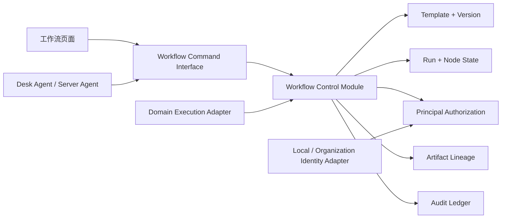
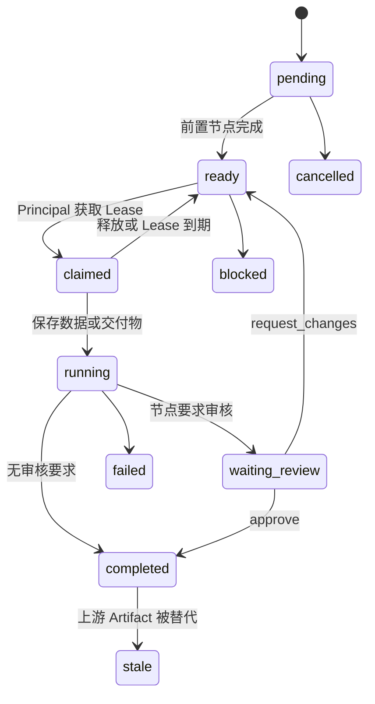

# Newma-Desk 组织工作流标准

## 目标

Workflow Control Module 让组织把投研、投决、创作、运营或其他协作过程表达为一套可复用、可运行、可授权、可交付、可审计的工作流。

它解决五件事：

1. 多节点 DAG 编排与模板版本。
2. 每个节点的数据、交付物和输入谱系保存。
3. 人和服务器 Agent 的责任分配与协同执行。
4. 跨多个工作流的授权、被授权和有限转授权。
5. 责任人、实际执行者和授权来源的统一审计。

## 深 Module



Workflow Command Interface 是调用方唯一需要理解的 Seam。模板校验、状态机、权限解析、租约、版本、stale 传播和审计全部留在 Implementation 中。Identity 与真实节点执行只有在存在第二个实现时才增加新的 Adapter。

## 组织结构

```text
Organization
├── Principal
│   ├── Human
│   └── Server Agent
├── Workflow Template
│   └── Template Version
├── Workflow Run
│   ├── Organization Workflow Node
│   ├── Node Assignment
│   ├── Execution Claim
│   ├── Node Data Revision
│   └── Workflow Artifact
├── Delegation Grant
└── Workflow Audit Ledger
```

### Principal

- Human：组织成员。
- Server Agent：有稳定 ID、显示名、能力标签和可选服务器端点的 Agent 身份。
- Principal 可以同时承担多个工作流节点，也可以同时拥有多条 incoming 和 outgoing Grant。
- Agent 会话不是 Principal。会话断开不改变 Assignment 或 Grant。

### 责任与权限分开

| 概念 | 含义 | 是否被授权替换 |
|---|---|---|
| accountable principal | 对节点结果负责 | 否 |
| reviewer principal | 对 Gate 或交付验收负责 | 否 |
| acting principal | 实际执行本次动作 | 每次动作不同 |
| Delegation Grant | acting principal 的权限来源 | 可撤销 |
| Execution Claim | 短期独占执行租约 | 到期或释放 |

授权人覆盖一个节点时，Workflow Audit Ledger 仍记录原 accountable principal。改派责任必须使用独立 Assignment Command，不能通过 Grant 隐式完成。

## Workflow Template

Template 保存：

- Workflow Matrix：纵向 Lane、横向 Stage，以及每个 Node 的稳定坐标引用。
- Node：ID、名称、说明、role key、task/review/gate/automation 类型、审核要求和预期输出。
- Edge：source、target；图必须是 DAG。
- Version：定义、变更说明、创建人和时间。

启动 Run 时固定 Template Version。模板的新版本不会改变已经启动的 Run。

### Workflow Matrix 与执行图

```text
             Stage 1       Stage 2       Stage 3
Lane A          A1            A2            A3
Lane B          B1            B2            B3
Lane C          C1            C2            C3
```

- Lane 是纵向业务域和工作流内部二级模块。
- Stage 是横向流程阶段和画布顶部三级标签。
- 每个坐标最多放一个主 Node；空坐标允许保留。
- A1、C3 是派生显示坐标，Node ID 才是稳定身份。
- DAG Edge 独立于矩阵坐标，允许跨行、跨列依赖。
- 成熟 Node 可以提升为所属 Lane 的快捷入口，但不会从画布或 Run 中复制出第二份状态。

## Workflow Run 与节点状态



当前实现将 `claimed` 作为明确状态；第一次保存节点数据或 Artifact 后进入 `running`。Run 的全部节点进入 completed、cancelled 或 skipped 后，Run 进入 completed。

## 授权模型

### Scope

Scope 从大到小：

```text
organization
└── template
    └── run
        ├── node
        └── role
```

- organization：整个组织。
- template：模板及由它产生的 Run。
- run：单个运行及其中节点、职能。
- node：单个运行中的单个节点。
- role：某模板全部 Run 或某个 Run 中具有相同 role key 的节点。

### Action

- read：读取。
- write：写节点数据和 Artifact。
- execute：Claim、Release、Submit。
- review：审核 Gate。
- assign：修改 Node Assignment。
- delegate：继续授权。
- admin：管理指定 Scope。

### 不扩权规则

创建子 Grant 时必须同时满足：

1. 子 Scope 被父 Scope 包含。
2. 子 Actions 是父 Actions 的子集。
3. 授权者拥有 delegate Action。
4. 父 Grant 明确允许转授权。
5. 子最大转授权深度小于父剩余深度。
6. 子有效期不晚于父 Grant。
7. 父 Grant 有效且其全部祖先有效。

若授权来自 Node Assignment，而非上游 Grant，Accountable Principal 可以在该 Node 内授权 read、write、execute 和 delegate，但不能扩成 run、template 或 organization Scope。

### 撤销

撤销一条 Grant 时，所有 `parentGrantId` 指向它或其后代的 Grant 同时变为 revoked。历史事件保留原 Grant ID，不删除记录。

## Execution Claim

- 一个 Run Node 同时只能有一个有效 Lease。
- Claim 保存 acting principal、Lease 到期时间和 Claim ID。
- 同一 Principal 可以续租。
- 其他 Principal 即使有 execute 权限，也必须等待 Lease 到期或释放。
- Submit、Review 完成或 Release 会清除 Claim。
- Claim 不改变 Node Assignment。

## 节点数据与交付物

### Node Data Revision

每个 `(run, node, slotKey)` 独立递增版本。适合保存：

- 结构化输入和参数。
- 研究证据摘要。
- 阶段判断与待核验项。
- 人工备注和 Agent 中间结果。

### Workflow Artifact

Artifact 保存：

- 稳定 artifact key 与递增 version。
- label、kind、URI 或小型内容。
- metadata。
- producer principal 与 node。
- input artifact IDs。
- current、stale 状态。

同一节点同一 artifact key 产生新版本时，旧版本继续保留但不再 current。仍引用旧版本的下游 current Artifact 会递归变为 stale，对应 Node 同时进入 stale。

## 审计

每次变更至少记录：

- organization、run、event type、时间。
- actor principal：实际执行者。
- accountable principal：节点责任人。
- delegation grant：若通过授权执行。
- 最小业务载荷：node、version、decision、stale targets 等。

审计事件只追加，不回写历史显示名或责任关系。

## 页面结构

| 页面 | 核心职责 |
|---|---|
| 工作台 | 模板、运行、待办、Agent、授权摘要 |
| 流程编排 | Node、Edge、role、Gate、输出和模板版本 |
| 运行中心 | Assignment、Claim、数据、Artifact、Submit、Review |
| 授权中心 | Scope、Action、转授权和撤销链 |
| 交付物 | 当前版本、输入谱系和 stale 状态 |
| 审计账本 | actor、accountable、Grant 和事件载荷 |
| 组织与 Agent | Human / Server Agent Registry |

## 与投决会、创作的关系

- Creator Studio：继续使用 Creator Run Control。未来新增 Creator Workflow Adapter，把创作 Run 的阶段摘要、Gate 和 Artifact 引用投影到组织 Workflow；不复制编辑器工程和发布状态。
- Orchestra：继续掌握现有投委会运行。未来新增 Orchestra Decision Adapter，把议题、席位、反方意见、主席决议和复核日期映射为组织节点与交付物。
- 新组织流程：直接使用 Workflow Control Module，不依赖 Creator 或 Orchestra。

## 本地身份与远程部署

当前 Desk 仅本地测试：

- Workspace ID 作为 Organization ID。
- `X-Workflow-Principal-Id` 作为本地 Identity Adapter，便于在页面切换 Human 与 Server Agent 验证授权。

若恢复远程部署，必须增加：

1. 可验证的用户和 Agent 凭证。
2. Principal 与凭证映射。
3. Server Agent 请求签名、防重放和短期令牌。
4. 组织成员目录与停用同步。

这些变化只替换 Identity Adapter；Workflow Command Interface、Grant、Assignment、Claim 和 Audit 语义保持不变。

## 当前交付与下一 Seam

当前代码已实现模板版本、Run、Assignment、Grant、不扩权、撤销级联、Claim Lease、Node Data Revision、Artifact 版本与 stale 传播、审计及七个页面。

下一步应增加 `Node Execution Interface`，并在至少有两个真实执行实现时建立 Seam：

- Desk Agent Task Adapter。
- 远程 Server Agent Adapter。

执行 Adapter 只能领取并执行已授权节点，不能自行修改 Assignment 或扩大 Grant。
